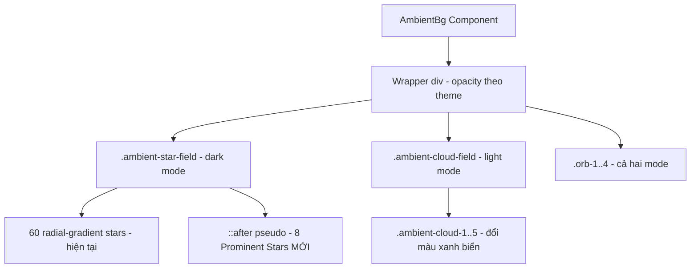

# Design Document: Background Visibility Fix

## Overview

Tài liệu thiết kế cho việc sửa lỗi hiển thị nền trang trí trong ứng dụng Huyền Bí. Thay đổi tập trung vào CSS: thêm ngôi sao nổi bật cho dark mode, nâng opacity tối thiểu của twinkle animation, và đổi màu mây từ trắng sang xanh biển cho light mode. Không có thay đổi logic JavaScript đáng kể — component `AmbientBg` đã có sẵn cơ chế `reducedMotion` và conditional rendering theo theme.

## Architecture

Thay đổi chỉ ảnh hưởng đến lớp presentation (CSS) trong file `src/index.css`. Component `ambient-bg.tsx` không cần sửa đổi vì:

- Prominent Stars được thêm dưới dạng CSS `::after` pseudo-element trên `.ambient-star-field` — không cần DOM element mới
- Cloud color thay đổi hoàn toàn trong CSS
- Logic `reducedMotion` hiện tại đã áp dụng `animation: none; opacity: 1` cho toàn bộ star field element, pseudo-element sẽ kế thừa behavior này



## Components and Interfaces

### 1. Prominent Stars Layer (CSS pseudo-element)

**File:** `src/index.css`  
**Selector:** `.ambient-star-field::after`

Thêm pseudo-element `::after` trên `.ambient-star-field` chứa 8 ngôi sao lớn (3-4px) với opacity cao (0.7-1.0) và màu vàng ấm/trắng.

**Lý do dùng `::after` thay vì thêm gradient vào element chính:**
- Tách biệt layer prominent stars khỏi 60 stars hiện tại → dễ maintain
- Có thể áp animation riêng (twinkle chậm hơn) nếu cần trong tương lai
- Không vi phạm Requirement 7.1 (vẫn trong cùng DOM element `.ambient-star-field`)
- `reducedMotion` style `animation: none; opacity: 1` trên parent sẽ cascade xuống pseudo-element

**CSS Properties:**
```css
.ambient-star-field::after {
  content: "";
  position: absolute;
  inset: 0;
  background-image:
    /* 8 prominent stars, 3-4px, opacity 0.7-1.0, phân bố đều 4 góc */
    radial-gradient(3px 3px at 15% 20%, hsl(43 90% 80% / 0.9) 0%, transparent 100%),
    radial-gradient(4px 4px at 78% 15%, hsl(43 80% 85% / 0.85) 0%, transparent 100%),
    radial-gradient(3px 3px at 35% 70%, hsl(40 95% 82% / 0.8) 0%, transparent 100%),
    radial-gradient(4px 4px at 85% 65%, hsl(43 85% 78% / 0.95) 0%, transparent 100%),
    radial-gradient(3px 3px at 55% 40%, hsl(45 90% 85% / 0.7) 0%, transparent 100%),
    radial-gradient(4px 4px at 22% 85%, hsl(43 80% 80% / 0.9) 0%, transparent 100%),
    radial-gradient(3px 3px at 68% 90%, hsl(40 90% 83% / 0.75) 0%, transparent 100%),
    radial-gradient(4px 4px at 92% 45%, hsl(43 95% 82% / 1.0) 0%, transparent 100%);
  animation: stars-field-twinkle 8s ease-in-out infinite;
}
```

**Phân bố vị trí (đảm bảo không cluster):**
- Quadrant trên-trái: 15% 20%, 22% 85% (2 stars)
- Quadrant trên-phải: 78% 15%, 92% 45% (2 stars)
- Quadrant dưới-trái: 35% 70%, 68% 90% (2 stars)
- Quadrant dưới-phải: 85% 65%, 55% 40% (2 stars)

### 2. Star Field Twinkle Animation Fix

**File:** `src/index.css`  
**Keyframe:** `@keyframes stars-field-twinkle`

Thay đổi opacity tối thiểu từ 0.3 lên 0.5:

```css
@keyframes stars-field-twinkle {
  0%, 100% { opacity: 0.5; }
  50%      { opacity: 1; }
}
```

**Lý do:** Với wrapper opacity 0.35, effective minimum hiện tại là 0.35 × 0.3 = 0.105 — gần như không thấy. Sau fix: 0.35 × 0.5 = 0.175 — vẫn subtle nhưng nhận biết được.

### 3. Cloud Color Change

**File:** `src/index.css`  
**Selector:** `.ambient-cloud`

Đổi background từ `rgba(255, 255, 255, 0.9)` sang ocean blue:

```css
.ambient-cloud {
  background: hsl(200 60% 75% / 0.85);
}
```

**Lý do chọn `hsl(200 60% 75% / 0.85)`:**
- Hue 200 nằm trong range 195-220 (Requirement 3.1)
- Saturation 60% trong range 40-70%
- Lightness 75% trong range 60-80%
- Alpha 0.85 đủ đậm để khi nhân với wrapper 0.15 → effective ~0.13 — vẫn nhẹ nhàng

### 4. Cloud Individual Opacity Adjustment

**File:** `src/index.css`  
**Selectors:** `.ambient-cloud-1` đến `.ambient-cloud-5`

Tăng opacity các cloud element lên range 0.5-0.9 (Requirement 4.2):

| Cloud | Hiện tại | Sau fix |
|-------|----------|---------|
| cloud-1 | 0.6 | 0.7 |
| cloud-2 | 0.5 | 0.65 |
| cloud-3 | 0.7 | 0.85 |
| cloud-4 | 0.45 | 0.6 |
| cloud-5 | 0.8 | 0.9 |

**Effective opacity (wrapper × cloud):**
- Cao nhất: 0.15 × 0.9 = 0.135
- Thấp nhất: 0.15 × 0.6 = 0.09

Với màu xanh biển trên nền kem, contrast đủ để nhận biết mà không gây mất tập trung.

## Data Models

Không có data model mới. Tất cả thay đổi là CSS values.

## Error Handling

### Reduced Motion
- Pseudo-element `::after` kế thừa `animation: none` khi parent có inline style `animation: none` (do `reducedMotion` logic trong component)
- Tuy nhiên, inline style trên parent không cascade xuống pseudo-element. Cần thêm CSS rule:

```css
.ambient-star-field[style*="animation: none"]::after,
.ambient-star-field[style*="animation:none"]::after {
  animation: none;
}
```

**Giải pháp thay thế (đơn giản hơn):** Dùng media query trực tiếp trong CSS:

```css
@media (prefers-reduced-motion: reduce) {
  .ambient-star-field::after {
    animation: none;
    opacity: 1;
  }
}
```

→ Chọn giải pháp media query vì đáng tin cậy hơn và không phụ thuộc vào inline style parsing.

### Browser Compatibility
- `::after` pseudo-element: hỗ trợ tất cả browser hiện đại
- `hsl()` với space syntax: hỗ trợ từ Chrome 101+, Firefox 113+, Safari 15+
- Fallback không cần thiết vì app đã dùng `hsl()` space syntax ở nhiều nơi khác

## Correctness Properties

Không áp dụng property-based testing cho feature này. Đây là thay đổi UI rendering thuần CSS — không có pure function với input/output có thể kiểm tra bằng PBT. Kiểm thử dựa trên visual inspection.

## Testing Strategy

### Tại sao KHÔNG dùng Property-Based Testing

Feature này là thay đổi CSS thuần túy (UI rendering):
- Không có logic function với input/output có thể test
- Không có data transformation
- Kết quả là visual — cần kiểm tra bằng mắt hoặc visual regression test

### Chiến lược kiểm thử

1. **Visual inspection (manual):**
   - Dark mode: xác nhận 8 prominent stars hiển thị rõ, phân bố đều
   - Dark mode: xác nhận star field twinkle không biến mất hoàn toàn ở frame thấp nhất
   - Light mode: xác nhận mây có màu xanh biển, nhìn thấy được trên nền kem
   - Cả hai mode: xác nhận orb layer không thay đổi

2. **Reduced motion check:**
   - Bật `prefers-reduced-motion: reduce` trong DevTools
   - Xác nhận prominent stars hiển thị tĩnh (không nhấp nháy)
   - Xác nhận clouds hiển thị tĩnh tại vị trí ban đầu

3. **Regression check:**
   - Orb animations vẫn hoạt động bình thường
   - Không có layout shift hoặc performance degradation
   - Existing star field (60 stars) vẫn hiển thị đúng vị trí

### Không có Correctness Properties

Do đây là thay đổi UI rendering thuần CSS, không có universal properties phù hợp cho property-based testing. Kiểm thử dựa trên visual inspection và manual verification.
