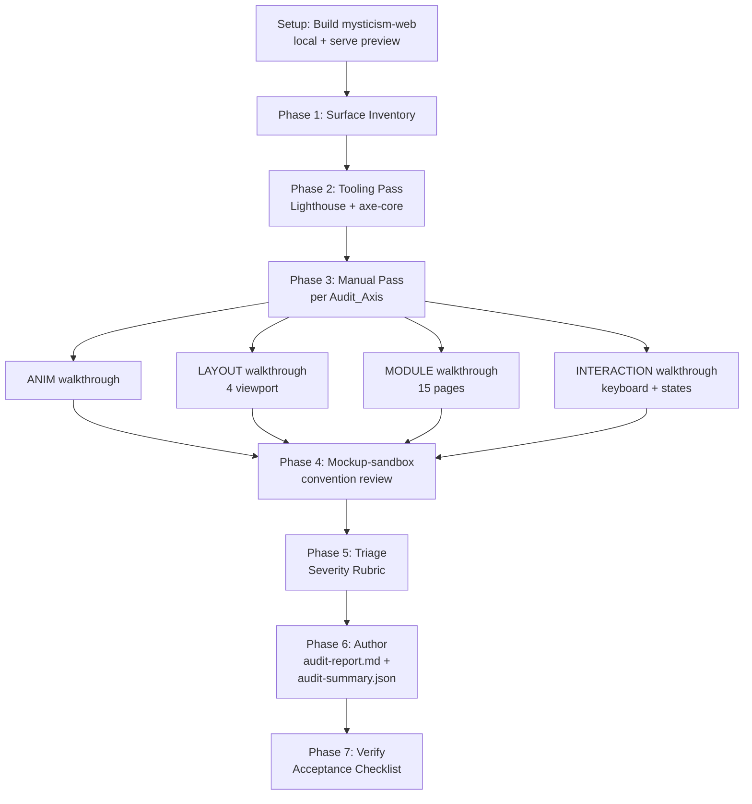

# Design Document — Frontend UX/UI Audit

## Overview

Spec này mô tả **thiết kế của một đợt audit** chứ không phải thiết kế một tính năng phần mềm. "Sản phẩm" được giao là ba artifact bất biến:

1. `audit-report.md` — báo cáo Markdown theo cấu trúc cố định.
2. `audit-summary.json` — bản sao machine-readable của tất cả Finding.
3. `audit-evidence/` — thư mục chứa screenshot, Lighthouse JSON, axe JSON, log keyboard walkthrough.

Trọng tâm thiết kế nằm ở ba điểm:

- **Quy trình (process)**: từng bước từ chuẩn bị môi trường, quét theo trục (`ANIM` / `LAYOUT` / `MODULE` / `INTERACTION`), thu thập evidence, viết Finding, kết bảng Audit_Backlog.
- **Cấu trúc dữ liệu (data shape)**: schema của một `Finding`, schema của `audit-summary.json`, layout thư mục `audit-evidence/`, format heading của Markdown report.
- **Cách kiểm chứng (verification)**: làm sao biết audit đã đạt 6 điều kiện acceptance ở Requirement 13 — bằng linter cho Markdown structure và JSON schema validator cho sidecar, KHÔNG phải bằng property-based testing (xem Testing Strategy).

Thiết kế cố tình giữ audit ở mức **assessment-only**: mọi recommendation đều là "WHAT/WHY/WHERE", không đi vào code patch — patch sẽ thuộc về spec triển khai khác (mở rộng `ux-ui-upgrade` hoặc spec mới sinh từ Audit_Backlog).

> **Lưu ý về Correctness Properties:** Section đó được **lược bỏ có chủ ý** vì deliverable là tài liệu (`audit-report.md` + `audit-summary.json` + thư mục evidence), không có hàm thuần để chạy 100+ iteration. R13.4 cũng ghi rõ "Audit_Report SHALL KHÔNG yêu cầu chạy bất kỳ test property-based nào". Verification dùng **JSON schema validator** + **Markdown structure linter** thay thế — xem Testing Strategy.

### Mối quan hệ với spec hiện có

- `ux-ui-upgrade` định nghĩa **target state** (Req 1–20). Audit này đo **current state**. Gap = Finding. Audit_Report tham chiếu `ux-ui-upgrade Req X.Y` thay vì copy nội dung.
- `post-opus-audit-remediation` thuộc trục security. Nếu Auditor gặp vấn đề security (XSS, secret leak), chỉ ghi note 1 dòng và link sang spec đó — KHÔNG viết finding chi tiết.

---

## Architecture

### Audit Pipeline



Quy trình tuần tự — **Tooling Pass trước Manual Pass**: dữ liệu định lượng (Lighthouse / axe) sinh ra trước, dùng làm "gợi ý" để Auditor không bỏ sót khi đi manual. Manual Pass có thẩm quyền cuối cùng vì tooling hay miss issue về information architecture, motion, brand identity.

### Artifact Layout

Toàn bộ output được giam trong `.kiro/specs/frontend-ux-ui-audit/`:

```
.kiro/specs/frontend-ux-ui-audit/
├── requirements.md              (đã có)
├── design.md                    (file này)
├── tasks.md                     (Phase 3)
├── audit-report.md              (deliverable chính)
├── audit-summary.json           (sidecar)
└── audit-evidence/
    ├── lighthouse/
    │   ├── home.json
    │   ├── than-so-hoc.json
    │   └── … 6 file khác
    ├── axe/
    │   ├── home.json
    │   ├── than-so-hoc.json
    │   └── … 6 file khác
    ├── responsive/
    │   ├── home-360x800.png
    │   ├── home-768x1024.png
    │   ├── home-1280x800.png
    │   ├── home-1920x1080.png
    │   └── … per route × 4 viewport
    ├── reduced-motion/
    │   ├── home-reduced.png
    │   ├── than-so-hoc-reduced.png
    │   └── ai-chat-reduced.png
    ├── keyboard/
    │   ├── flow-a-home-to-module.md
    │   ├── flow-b-sign-in.md
    │   └── flow-c-ai-chat.md
    └── README.md                (giải thích layout)
```

`audit-evidence/README.md` là metadata cho thư mục — danh sách file, thời điểm chụp, browser version. Nếu một file không có (ví dụ Lighthouse mobile fail), README ghi rõ "missing — see Methodology > Limitations".

### Reference Frame: Heuristic_Set + Tooling_Set

Audit dùng song song **rubric phẩm chất** (Heuristic_Set) và **rubric định lượng** (Tooling_Set). Mỗi Finding gắn vào ít nhất một rubric qua trường `references`:

| Rubric                          | Reference format                    | Ví dụ                                  |
|---------------------------------|-------------------------------------|----------------------------------------|
| Nielsen 10                      | `Nielsen #N: <name>`                | `Nielsen #4: Consistency and standards`|
| WCAG 2.1                        | `WCAG 2.1 SC X.Y.Z (Level A/AA)`    | `WCAG 2.1 SC 2.4.7 (Level AA)`         |
| Core Web Vitals                 | `CWV: <metric>`                     | `CWV: INP`                             |
| Material Motion / FM            | `Motion: <principle>`               | `Motion: Easing > linear`              |
| `ux-ui-upgrade` (target state)  | `ux-ui-upgrade Req X.Y`             | `ux-ui-upgrade Req 9.3`                |

Quy ước này được liệt kê thành bảng trong `Methodology` của report để reviewer biết phải đọc reference ở đâu.

---

## Components and Interfaces

Audit không có "component code", nhưng có **các phần mục logic** được nối với nhau qua hợp đồng cụ thể. Chia thành 5 nhóm.

### C1. Surface Inventory Table

**Mục đích:** Ràng buộc Audit_Surface coverage (R1.1, R1.2, R1.3).

**Interface:** Bảng Markdown trong section `## Scope`:

```markdown
| Surface             | Path                                          | Status   | Reason       |
|---------------------|-----------------------------------------------|----------|--------------|
| home                | artifacts/mysticism-web/src/pages/home.tsx    | Audited  | —            |
| than-so-hoc         | …/pages/than-so-hoc.tsx                       | Audited  | —            |
| __clerk-mock-x      | (excluded)                                    | Skipped  | dev mock file|
```

**Hợp đồng:**
- Mỗi Audit_Surface ở R1.2 **phải** xuất hiện đúng một lần.
- `mockup-sandbox` xuất hiện đúng một lần với `Audited (convention only)`.
- Section `Unaudited States` ngay sau bảng — bắt buộc tồn tại kể cả khi rỗng (ghi "Tất cả state đã được audit").

### C2. Audit_Axis Worksheets (4 trục)

**Mục đích:** Đảm bảo từng trục có findings đầy đủ (R3, R7–R10).

Mỗi axis là một worksheet trong report, theo template:

```markdown
## Findings — ANIM (Hiệu ứng)

<axis summary: 1–2 đoạn — quan sát chung, mức độ tổng thể>

### F-ANIM-01: <title>

- **Severity:** P1
- **Surface:** ambient-bg
- **Axis:** ANIM
- **References:** ux-ui-upgrade Req 10.8; WCAG 2.1 SC 2.3.3 (Level AAA)
- **Description:** …
- **Evidence:** `./audit-evidence/lighthouse/home.json` (Best Practices), `src/components/ambient-bg.tsx:42`
- **Recommendation:** WHAT … WHY … WHERE …

### F-ANIM-02: …
```

**Hợp đồng:**
- 4 axis (`ANIM`, `LAYOUT`, `MODULE`, `INTERACTION`) đều có ít nhất 1 finding (R3.1). Nếu zero issue thực sự, vẫn phải có 1 entry `F-AXIS-NN` severity `INFO` ghi nhận "đã quét, không phát hiện vấn đề" kèm bằng chứng (R3.6).
- Mỗi axis có một **checklist tham chiếu** in trên đầu worksheet — sao chép từ tiêu chí R7/R8/R9/R10. Ví dụ ANIM checklist:
  - [ ] Mọi animation thời lượng [120ms, 800ms]?
  - [ ] `prefers-reduced-motion: reduce` được honor?
  - [ ] Easing không dùng `linear` cho translate/scale?
  - [ ] `ambient-bg` opacity ≤ 35% dark / ≤ 15% light?
  - [ ] `tilt-card` max ±15°?
  - [ ] AI streaming markdown render incremental?
  - [ ] `mystic-cursor` ẩn trên touch + `aria-hidden`?
  
  Mỗi item tick `[x]` khi đã kiểm tra (kể cả pass). Item failed sinh ra Finding tương ứng.

### C3. Finding (atomic unit)

**Mục đích:** Đơn vị thông tin tái sử dụng được giữa Markdown report và JSON sidecar (R2).

**Markdown form:** xem ví dụ ở C2.

**JSON form:** xem Data Models > `Finding` schema bên dưới.

**Hợp đồng đồng bộ:**
- Mỗi Finding tồn tại **đồng thời** ở Markdown và JSON với cùng `id`.
- Khi `recommendation` đổi, cả hai phải đổi.
- `audit-summary.json` được generate-able lại từ Markdown bằng parser đơn giản (regex theo heading), nhưng nguồn chân lý là Markdown — JSON chỉ là projection. Quy trình implementation sẽ build script `scripts/generate-summary.mjs` (gợi ý, không bắt buộc) để tự động sync; nếu viết tay thì Auditor chịu trách nhiệm giữ đồng bộ.

### C4. Severity Rubric Block

**Mục đích:** Chuẩn hoá phân loại (R5).

**Interface:** Section `## Severity Rubric` đặt giữa `## Methodology` và `## Findings`. Format:

```markdown
## Severity Rubric

| Severity | Tiêu chí (cần thoả ≥ 1)                                               |
|----------|------------------------------------------------------------------------|
| **P0**   | (a) WCAG 2.1 A/AA bắt buộc bị vi phạm; (b) hiểu nhầm dữ liệu nghiêm trọng; (c) form không submit / data loss; (d) layout vỡ ≥ 360px |
| **P1**   | (a) Nielsen heuristic vi phạm có workaround; (b) inconsistency ≥ 3 surface; (c) motion sickness chưa honor reduced-motion; (d) loading/error state thiếu; (e) Lighthouse a11y < 90 |
| **P2**   | (a) polish ≤ 2 surface; (b) nice-to-have; (c) gap với target state không ảnh hưởng UX hiện tại; (d) micro-interaction tăng cảm giác cao cấp |
| **INFO** | Trục đã kiểm tra nhưng không tìm thấy vấn đề (R3.1, R3.6)              |

Khi một Finding rơi nhiều mức, chọn mức **cao nhất** và ghi lý do trong `description`.
```

`INFO` là mức bổ sung — không phải severity backlog. Bảng Audit_Backlog (R6.6) chỉ chứa P0/P1/P2.

### C5. Audit_Backlog Tables

**Mục đích:** Output cho người ra quyết định (R6.6).

**Interface:** Section cuối Findings, trước `## Appendices`:

```markdown
## Audit_Backlog

### P0 (Blocker)

| id          | title          | axis        | surface | effort | recommendation summary           |
|-------------|----------------|-------------|---------|--------|----------------------------------|
| F-INTER-01  | Focus ring … | INTERACTION | navbar  | S      | Thêm `focus-visible` ring …      |

### P1 (Major)

| id | title | axis | surface | effort | recommendation summary |

### P2 (Minor)

| id | title | axis | surface | effort | recommendation summary |
```

**Hợp đồng:**
- 3 bảng cố định dù trống. Bảng trống có header và 1 dòng `| — | — | — | — | — | (không phát hiện) |`.
- Cột `effort`: `S` (≤ ½ ngày), `M` (½–2 ngày), `L` (> 2 ngày). Auditor gán dựa trên kinh nghiệm — không cần định lượng nghiêm.
- Cột `recommendation summary` ≤ 80 ký tự (R6.6).

---

## Data Models

### Finding (TypeScript-style schema)

```ts
type Severity = "P0" | "P1" | "P2" | "INFO";
type Axis = "ANIM" | "LAYOUT" | "MODULE" | "INTERACTION";

interface Reference {
  // Tự do: "Nielsen #N: …", "WCAG 2.1 SC X.Y.Z (Level A/AA)",
  //       "ux-ui-upgrade Req X.Y", "CWV: <metric>", "Motion: …"
  text: string;
}

interface EvidenceItem {
  // Đúng một trong các nhánh sau phải khác null/empty.
  fileLine?: string;       // ví dụ "src/components/ambient-bg.tsx:42"
  screenshot?: string;     // ví dụ "./audit-evidence/responsive/home-360x800.png"
  toolingOutput?: string;  // ví dụ "./audit-evidence/lighthouse/home.json#audits.color-contrast"
  reproSteps?: string[];   // ≥ 3 bước nếu dùng nhánh này
}

interface Finding {
  id: string;                          // F-ANIM-01, F-LAYOUT-12, …
  title: string;                       // ≤ 100 ký tự, không có markdown
  axis: Axis;
  severity: Severity;
  surface: string;                     // tên Audit_Surface (khớp Surface Inventory)
  description: string;                 // 1–5 đoạn ngắn
  evidence: EvidenceItem[];            // ≥ 1 item, mỗi item ≥ 1 nhánh
  recommendation: {
    what: string;
    why: string;
    where: string;                     // file path hoặc tên component
  };
  references: Reference[];             // ≥ 1 nếu severity ≠ INFO
  effort?: "S" | "M" | "L";            // chỉ Finding có severity P0/P1/P2 mới có
}
```

**Constraint chéo:**
- `id` regex: `/^F-(ANIM|LAYOUT|MODULE|INTERACTION)-\d{2,}$/`. Số đếm tăng dần trong axis, không tái sử dụng kể cả khi xoá.
- `severity = INFO` ⇒ `evidence` vẫn cần ≥ 1 item (bằng chứng đã kiểm tra), nhưng `references` có thể rỗng.
- `severity = P0/P1` ⇒ tối thiểu 1 reference đến Heuristic_Set hoặc `ux-ui-upgrade`.
- Khi `evidence.reproSteps` được dùng, các nhánh khác có thể không cần — nhưng `description` phải nói rõ "không có evidence cụ thể" để khớp R2.8.

### `audit-summary.json` (root schema)

```ts
interface AuditSummary {
  meta: {
    auditor: string;            // "Kiro agent" hoặc tên người
    auditDate: string;          // ISO 8601, ví dụ "2025-11-21"
    repoCommit: string;         // git SHA tại thời điểm audit
    appVersion: string;         // version từ package.json
    browsers: string[];         // ["Chrome 131.0.6778.139"]
    viewports: Array<{ name: string; width: number; height: number }>;
  };
  scope: {
    auditedSurfaces: string[];  // tên surface
    skippedSurfaces: Array<{ surface: string; reason: string }>;
    unauditedStates: Array<{ surface: string; state: string; reason: string }>;
  };
  rubric: {
    severityDefinitions: Record<Severity, string>;
    heuristicSets: string[];    // ["Nielsen 10", "WCAG 2.1 AA", "CWV", "Material Motion", "ux-ui-upgrade"]
  };
  totals: {
    P0: number;
    P1: number;
    P2: number;
    INFO: number;
    byAxis: Record<Axis, number>;
  };
  findings: Finding[];
}
```

**Hợp đồng:**
- `findings.length === totals.P0 + totals.P1 + totals.P2 + totals.INFO` (validator check).
- `totals.byAxis` tổng = `findings.length`.
- Mọi `evidence.screenshot` và `evidence.toolingOutput` reference đường dẫn relative bắt đầu bằng `./audit-evidence/` (R6.8).
- File JSON parse được bằng `JSON.parse` (R13.1.f).

### Evidence file naming

Quy ước cố định để regex matching trong validator dễ:

| Loại            | Pattern                                                  | Ví dụ                                |
|-----------------|----------------------------------------------------------|--------------------------------------|
| Lighthouse JSON | `lighthouse/{route-slug}.json`                           | `lighthouse/than-so-hoc.json`        |
| axe JSON        | `axe/{route-slug}.json`                                  | `axe/ai-chat.json`                   |
| Responsive PNG  | `responsive/{route-slug}-{w}x{h}.png`                    | `responsive/home-360x800.png`        |
| Reduced motion  | `reduced-motion/{route-slug}-reduced.png`                | `reduced-motion/home-reduced.png`    |
| Keyboard log    | `keyboard/flow-{a|b|c}-{slug}.md`                        | `keyboard/flow-a-home-to-module.md`  |

`route-slug` = path không có `/`, dùng `-` cho root (`/` → `home`). Naming này được enforce bởi structure linter ở Testing Strategy.

### Audit_Report section ordering (R6.2)

Thứ tự bắt buộc, không hoán đổi:

```
1. # Frontend UX/UI Audit Report          (heading 1)
2. <Table of Contents>                     (R6.3, manual hoặc auto)
3. ## Executive Summary
4. ## Scope                                (chứa Surface Inventory + Unaudited States)
5. ## Methodology                          (Heuristic_Set + Tooling_Set + Limitations nếu có)
6. ## Severity Rubric
7. ## Relationship to Existing Specs       (R12.1)
8. ## Findings
   ├── ## Findings — ANIM
   ├── ## Findings — LAYOUT
   ├── ## Findings — MODULE
   ├── ## Findings — INTERACTION
   └── ## Findings — Mockup Sandbox        (R11.5)
9. ## Audit_Backlog                        (3 bảng P0/P1/P2)
10. ## Appendices                           (link tới audit-evidence/)
11. ## Acceptance Checklist                 (R13.2)
```

Cấu trúc này được structure linter kiểm tra (xem Testing Strategy).

---

## Error Handling

Trục lỗi của một đợt audit khác trục lỗi của runtime code. Liệt kê theo nhóm:

### E1. Tooling Failure (Lighthouse / axe không chạy được)

**Triệu chứng:** Lighthouse mobile emulation fail vì local không có HTTPS, axe-core throw trên page có Web Worker, route timeout.

**Xử lý:**
1. Ghi vào `Methodology > Limitations` với cấu trúc cố định: `<tool> on <route>: <error message> — fallback: <what was done instead>`.
2. Tạo placeholder file evidence (`lighthouse/<route>.json` chứa `{"error": "<message>"}`) để structure linter không lỗi.
3. Nếu route quan trọng (R4.3 list), KHÔNG được skip âm thầm — phải có entry trong `unauditedStates` của summary JSON.

**Ngưỡng escalation:** Nếu ≥ 3 trên 8 route Lighthouse fail, audit bị coi là chưa hoàn thành (Acceptance Checklist không tick được item evidence).

### E2. Route Reproduction Failure (page không load được local)

**Triệu chứng:** `pnpm dev` không khởi động được, Clerk dev keys missing, backend dependency thiếu.

**Xử lý:**
1. Audit **vẫn tiếp tục** — phần lớn trục `LAYOUT` và `INTERACTION` có thể đánh giá qua source code reading + screenshot từ deployed env nếu có.
2. State không reproduce được vào `Unaudited States` với lý do cụ thể.
3. Severity của Finding không có evidence runtime tuân R2.8 — vẫn được phép P0/P1 nếu lý luận rõ ràng (ví dụ: thiếu `aria-label` trên button rõ trong source).

### E3. Severity Disagreement (cùng issue rơi nhiều mức)

**Triệu chứng:** Một focus-ring contrast issue vừa vi phạm WCAG SC 1.4.11 (P0) vừa vi phạm Nielsen #1 visibility (P1).

**Xử lý:** R5.5 — chọn mức **cao nhất**, ghi lý do trong `description`. Không tách thành 2 finding riêng nếu cùng surface, cùng nguyên nhân gốc.

### E4. Evidence không khả thi (vấn đề lý thuyết)

**Triệu chứng:** Auditor nhận thấy "thiếu skip-link" nhưng đây là vấn đề có thể demonstrate bằng keyboard walkthrough, không bằng screenshot dễ thấy.

**Xử lý:** R2.8 — `evidence.reproSteps` ≥ 3 bước thay cho screenshot/file:line. `description` ghi rõ "evidence là reproduction steps vì vấn đề chỉ rõ khi tương tác".

### E5. Scope Overlap với spec security / spec triển khai

**Triệu chứng:** Auditor phát hiện XSS trong Markdown_Renderer, hoặc thấy gap rõ với `ux-ui-upgrade` Req 9.

**Xử lý (R12):**
- Security: 1-line note + link `post-opus-audit-remediation`. KHÔNG mở finding chi tiết trong audit này.
- Gap với `ux-ui-upgrade`: dùng reference `ux-ui-upgrade Req X.Y` trong `references`, viết description chỉ về **gap measurement** (ví dụ: "Spec yêu cầu opacity ≤ 35%, đo được 42%"), không bàn lại context của target state.

### E6. JSON sidecar không sync với Markdown

**Triệu chứng:** Auditor sửa Markdown nhưng quên cập nhật `audit-summary.json`.

**Xử lý:**
- Acceptance Checklist có item "JSON parse được + counts khớp Markdown headings" — fail item này → audit chưa hoàn thành.
- Khuyến nghị (không bắt buộc) build script `scripts/generate-summary.mjs` để regenerate JSON từ Markdown headings; nếu Auditor chọn viết tay, phải chạy structure linter kép trước commit.

### E7. Evidence binary quá lớn

**Triệu chứng:** Screenshot full-page > 5MB (R13.5).

**Xử lý:**
- Optimize PNG bằng `pngquant` hoặc `oxipng` xuống ≤ 5MB; chấp nhận lossy ≤ 60% chất lượng cho full-page (R13.5).
- Nếu vẫn quá lớn, crop về vùng chứa vấn đề.
- Pre-commit check: file > 5MB trong `audit-evidence/` → block commit.

---

## Testing Strategy

Vì Correctness Properties không áp dụng, "test" ở đây là **kiểm chứng tự động cấu trúc deliverable**. Mục tiêu: trước khi tick Acceptance Checklist (R13), Auditor có thể chạy 1 lệnh để biết report có đầy đủ format không.

### TS1. JSON Schema Validation

**Mục đích:** Verify `audit-summary.json` đúng schema ở Data Models > `AuditSummary`.

**Tooling:** [Ajv](https://ajv.js.org/) (Node.js JSON schema validator) hoặc `zod` nếu Auditor đã quen TS.

**Kiểm tra:**
1. JSON parse được bằng `JSON.parse` (R13.1.f).
2. Mọi field bắt buộc tồn tại (`meta.auditor`, `meta.auditDate`, `meta.repoCommit`, `findings`, …).
3. `id` của mỗi finding match regex `/^F-(ANIM|LAYOUT|MODULE|INTERACTION)-\d{2,}$/`.
4. `findings.length === totals.P0 + totals.P1 + totals.P2 + totals.INFO`.
5. `totals.byAxis[axis] === findings.filter(f => f.axis === axis).length` cho mọi axis.
6. Mỗi `evidence` item có đúng một nhánh khác null/empty.
7. Mọi đường dẫn screenshot/tooling output bắt đầu bằng `./audit-evidence/` (R6.8).

**Implementation gợi ý:** `scripts/validate-summary.mjs` đặt cạnh report; chạy bằng `node scripts/validate-summary.mjs`. Exit 0 = pass, exit 1 + lỗi cụ thể = fail.

### TS2. Markdown Structure Linter

**Mục đích:** Verify `audit-report.md` tuân Audit_Report section ordering (R6.2) và Finding format (R2).

**Tooling:** Script Node.js đơn giản đọc file, dùng [`remark`](https://github.com/remarkjs/remark) hoặc regex để parse heading tree.

**Kiểm tra:**
1. Heading level 1 đúng một, text bằng `Frontend UX/UI Audit Report`.
2. Có Table of Contents trước heading level 2 đầu tiên (R6.3).
3. Heading level 2 xuất hiện đúng thứ tự ở Data Models > section ordering.
4. Mỗi heading level 3 trong `## Findings — *` match pattern `^F-(ANIM|LAYOUT|MODULE|INTERACTION)-\d{2,}: .+$`.
5. Mỗi Finding heading L3 được theo sau bởi block metadata chứa cả `Severity:`, `Surface:`, `Axis:`, `References:` (R2.1).
6. `## Audit_Backlog` chứa đúng 3 sub-section `### P0`, `### P1`, `### P2` với bảng Markdown 6 cột (R6.6).
7. Mọi đường dẫn screenshot trong report là relative `./audit-evidence/...` (R6.8).
8. Không có HTML inline color hoặc hex hard-code (R6.5) — regex tìm `style="color:` hoặc `<font color`, fail nếu match.

**Implementation gợi ý:** `scripts/lint-report.mjs`. Dùng cùng cơ sở hạ tầng với TS1.

### TS3. Cross-File Consistency Check

**Mục đích:** Đảm bảo Markdown và JSON đồng bộ (E6).

**Kiểm tra:**
1. Mọi `id` của finding heading L3 trong Markdown xuất hiện trong `findings[].id` của JSON (và ngược lại).
2. Severity của Finding khớp giữa hai file.
3. Số Finding trong Audit_Backlog tables khớp với `totals.P0/P1/P2` của JSON.

**Implementation gợi ý:** Tích hợp vào `scripts/lint-report.mjs` sau khi parse cả hai file.

### TS4. Evidence File Existence Check

**Mục đích:** Mọi reference path trong Markdown / JSON thực sự tồn tại trên disk (E1, E7).

**Kiểm tra:**
1. Liệt kê mọi path `./audit-evidence/...` từ Markdown và JSON, dùng `fs.existsSync`.
2. Mọi file dưới `audit-evidence/` ≤ 5MB (R13.5). File lớn hơn → fail với message gợi ý optimize.
3. Naming match Evidence file naming pattern ở Data Models.
4. Ít nhất 1 file `lighthouse/*.json`, 1 file `axe/*.json`, 1 file `responsive/*.png`, 1 file `reduced-motion/*.png`, 1 file `keyboard/flow-*.md` — minimum coverage cho R13.1.e.

### TS5. Acceptance Checklist Verification (manual gate)

**Mục đích:** Cuối cùng vẫn cần Auditor xác nhận chất lượng nội dung — TS1–TS4 chỉ kiểm cấu trúc.

**Kiểm tra (manual review):**
- [ ] Mỗi Finding có `description` ≥ 1 đoạn (không phải chỉ title)?
- [ ] Mọi `recommendation.what/why/where` không rỗng?
- [ ] References thực sự liên quan tới issue (không paste random WCAG SC)?
- [ ] Severity gán đúng theo rubric, không inflation/deflation?

Mục này không tự động hoá — nhưng Acceptance Checklist trong report yêu cầu Auditor tự tick (R13.2).

### TS6. Smoke run script

**Mục đích:** Một command chạy tuần tự TS1 → TS4, fail-fast.

**Implementation gợi ý:** `scripts/audit-verify.mjs` hoặc đơn giản là `npm run audit:verify` trong `package.json` của repo gốc:

```json
{
  "scripts": {
    "audit:verify": "node .kiro/specs/frontend-ux-ui-audit/scripts/audit-verify.mjs"
  }
}
```

Output mong đợi:
```
✓ JSON schema valid
✓ Markdown structure valid
✓ Cross-file consistency OK (38 findings matched)
✓ Evidence files exist (lighthouse: 8, axe: 8, responsive: 32, …)
✓ All evidence ≤ 5MB
Audit verification PASSED.
```

### TS7. Tại sao không dùng property-based testing

Tóm tắt lý do (đã giải thích ở Correctness Properties):

| Đặc điểm PBT cần có          | Audit này có?                                                |
|------------------------------|--------------------------------------------------------------|
| Hàm thuần với input/output   | Không — output là tài liệu thủ công                          |
| Universal property "for all" | Không — không có không gian input để quantify                |
| 100+ iteration tăng tin cậy  | Không — chạy 1 lần là đủ                                     |
| Cost-effective per iteration | Tương đối — nhưng không có benefit từ iteration              |

Verification tương đương đạt được bằng schema validation + structure linter (TS1–TS6), với chi phí thấp hơn và phù hợp ngữ cảnh deliverable tài liệu.

---

## Open Design Decisions

Một số quyết định nhỏ vẫn để mở, không ảnh hưởng tới cấu trúc chính nhưng cần xác nhận khi vào Tasks:

1. **Auto-generate vs hand-write JSON sidecar:** Thiết kế ưu tiên hand-write để đơn giản; nếu volume Finding > 30, build `scripts/generate-summary.mjs` để tránh sync drift.
2. **Storybook a11y addon:** R7 ghi nhận tooling tối thiểu là Lighthouse + axe. Nếu muốn gọn nhẹ thì dùng `@axe-core/playwright` chạy headless; addon Storybook không bắt buộc.
3. **Cross-browser audit:** Open question 7 trong requirements — mặc định Chrome only. Nếu mở rộng Firefox/Safari thì phải nhân số screenshot lên — cân nhắc effort vs giá trị.
4. **Lighthouse 8 route subset vs full 15:** Open question 3 — giữ 8 route đại diện. Nếu muốn full, tasks phase sẽ thêm 7 route Lighthouse runs.

Các quyết định này không cản trở việc bắt đầu Phase 3 (Tasks) — sẽ được làm rõ khi viết task tương ứng.
