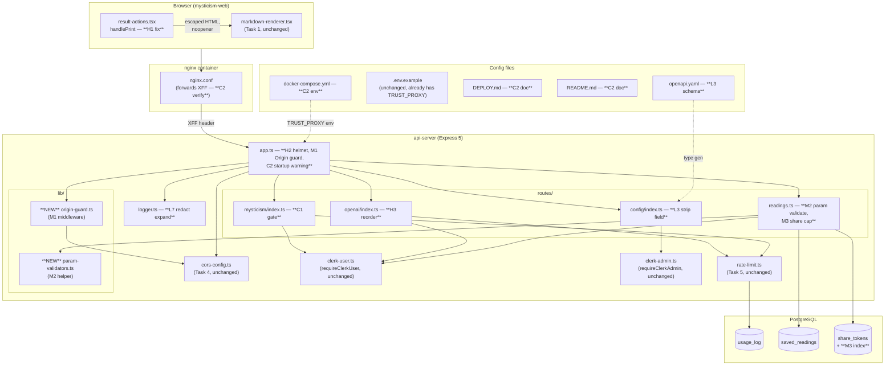

# Design Document

## Overview

Đây là **remediation design** cho 10 findings còn sót của adversarial re-audit (tham chiếu `requirements.md` và `AUDIT_PLAN_PROGRESS.md` Task 0–8). Design không thêm tính năng mới; mục tiêu là vá 9 requirement (C1, C2, H1, H2, H3, M1, M2, M3, L3+L7) bằng những thay đổi **tối thiểu, cục bộ**, reuse nguyên vẹn các lớp đã harden ở Task 1/4/5/7 (markdown renderer, CORS middleware, rate-limit core, SSE parser).

Bốn nguyên tắc chi phối mọi quyết định:

1. **Tái sử dụng, không viết lại.** `requireClerkUser`, `requireClerkAdmin`, `getClientIP`, `isOriginAllowed`, advisory-lock pattern trong `rate-limit.ts` — tất cả đã được kiểm thử. Design bám vào API hiện có, không chạm core.
2. **Fail-closed.** Khi cấu hình thiếu (Clerk keys, TRUST_PROXY, rate-limit allowance), hệ thống từ chối trước khi chạm tài nguyên đắt (provider AI, DB insert).
3. **Thứ tự thao tác quan trọng.** Authorization → validation → rate-limit → state mutation → side-effect. H3 chính là biểu hiện của nguyên tắc này bị phá.
4. **Defense-in-depth.** Helmet + nginx, CORS + Origin check, rate-limit bucket + DB cap. Không layer nào được phép là layer duy nhất.

Scope có chủ đích **loại trừ**: refactor rate-limit algorithm, refactor SSE parser, đổi CORS logic, đổi schema chính, đổi admin auth strategy. Xem `requirements.md` → section Non-Goals.

## Architecture

Sơ đồ dưới đây thể hiện các điểm chạm (touch points) của spec này vào kiến trúc hiện tại. Các hộp đậm là code mới/modified; các hộp mờ là code không đổi, chỉ để reference.



**Change footprint** (files touched in this spec):

| Layer | File | Type | Finding |
|---|---|---|---|
| Backend app | `artifacts/api-server/src/app.ts` | modify | H2, M1, C2 |
| Backend route | `artifacts/api-server/src/routes/mysticism/index.ts` | modify | C1 |
| Backend route | `artifacts/api-server/src/routes/openai/index.ts` | modify | H3 |
| Backend route | `artifacts/api-server/src/routes/readings.ts` | modify | M2, M3 |
| Backend route | `artifacts/api-server/src/routes/config/index.ts` | modify | L3 |
| Backend lib | `artifacts/api-server/src/lib/logger.ts` | modify | L7 |
| Backend lib | `artifacts/api-server/src/lib/param-validators.ts` | **new** | M2 |
| Backend lib | `artifacts/api-server/src/lib/origin-guard.ts` | **new** | M1 |
| Backend lib | `artifacts/api-server/src/lib/migrate.ts` | modify (idempotent) | M3 |
| Backend deps | `artifacts/api-server/package.json` | modify (helmet dep + test scripts) | H2, and test scripts for every req |
| Frontend | `artifacts/mysticism-web/src/components/result-actions.tsx` | modify | H1 |
| Frontend deps | `artifacts/mysticism-web/package.json` | modify (test script) | H1 |
| API spec | `lib/api-spec/openapi.yaml` | modify | L3 |
| Ops | `docker-compose.yml` | modify | C2 |
| Ops | `docker/nginx.conf` | verify (no change expected) | C2 |
| Docs | `DEPLOY.md` | modify | C2 |
| Docs | `README.md` | modify (nhắc section Docker) | C2 |

**Files explicitly NOT touched** (protected by Non-Goals):
`lib/rate-limit.ts` core algorithm, `lib/cors-config.ts`, `lib/sse-stream.ts`, `markdown-renderer.tsx`, schemas `conversations/messages/readings/rate_limits`, Clerk admin strategy.

## Components and Interfaces

This section describes each remediation at the component level. Decisions labeled **DECISION** resolve branch-points that requirements left open.

### 1. C1 — Clerk gate for `AI_Interpret_Endpoint`

**Problem.** `POST /api/mysticism/ai-interpret` rate-limits per IP only. Anonymous botnet with rotating IPs drains system AI key.

**Approach.** Mount `requireClerkUser` at the route level inside `routes/mysticism/index.ts`, mirroring the pattern in `routes/openai/index.ts` (`router.use("/openai/conversations", requireClerkUser)`).

**Interface change (router mount):**
```ts
// routes/mysticism/index.ts (after the router creation, before the route handler)
import { requireClerkUser } from "../../lib/clerk-user";

router.use("/mysticism/ai-interpret", requireClerkUser);
```

**Why mount at path instead of per-handler:** The file currently exposes exactly one route under `/mysticism/*`. A path-level `router.use` is idempotent with `requireClerkUser` and keeps the handler body unchanged. If future sub-routes (e.g. `/mysticism/batu-analyze`) need public access, they would mount on a separate sub-router.

**Fail-closed behavior:** `requireClerkUser` already returns 401 when `getAuth(req)` yields no `userId`. When `CLERK_SECRET_KEY` or `CLERK_PUBLISHABLE_KEY` is missing, `app.ts` does **not** register `clerkMiddleware` — `getAuth` returns an empty result → every request to `/mysticism/ai-interpret` receives 401. This satisfies Requirement 1, AC 5.

**Preserved behavior:**
- Existing rate-limit bucket (`ai-interpret`) still fires on `usingServerKey` path (AC 4).
- Streaming flow, provider routing, AbortController cleanup — all untouched.

### 2. C2 — `TRUST_PROXY` wired into docker-compose + startup warning

**Problem.** Compose default runs api behind nginx container in a bridge network but never sets `TRUST_PROXY`. `req.ip` collapses to nginx's IP → whole site shares one rate-limit bucket.

**DECISION — value for `TRUST_PROXY` in compose:** `loopback, linklocal, uniquelocal`.

Rationale: The nginx container IP in a Docker bridge network falls inside `172.16.0.0/12` (Docker's default bridge range, part of RFC 1918 "uniquelocal"). `loopback,linklocal,uniquelocal` is a named preset Express supports directly; it trusts all private ranges without hard-coding an IP that changes between `docker compose down -v` cycles. Hop-count (`1`) is a viable alternative but fragile: if operators add a CDN (Cloudflare) in front, the hop count silently becomes wrong. Named presets remain correct as long as there is exactly one layer of private proxy immediately upstream.

**Interface change (compose):**
```yaml
# docker-compose.yml, service: api
environment:
  NODE_ENV:              production
  PORT:                  3001
  DATABASE_URL:          postgresql://${POSTGRES_USER:-huyenbi}:${POSTGRES_PASSWORD:-huyenbi_secret}@postgres:5432/${POSTGRES_DB:-huyenbi}
  CLERK_SECRET_KEY:      ${CLERK_SECRET_KEY:-}
  CLERK_PUBLISHABLE_KEY: ${VITE_CLERK_PUBLISHABLE_KEY:-}
  # When the api sits behind the nginx container in the same bridge network,
  # Express needs to trust the XFF header added by nginx so `req.ip` reflects
  # the real client. loopback,linklocal,uniquelocal covers Docker's private
  # ranges without hard-coding an IP that shifts between recreations.
  # Override this if you add a CDN upstream (use hop-count) or run without a
  # proxy (leave blank). See DEPLOY.md.
  TRUST_PROXY:           ${TRUST_PROXY:-loopback,linklocal,uniquelocal}
```

**nginx verification (no code change expected).** Current `docker/nginx.conf` already sets:
```
proxy_set_header X-Real-IP         $remote_addr;
proxy_set_header X-Forwarded-For   $proxy_add_x_forwarded_for;
```
`$proxy_add_x_forwarded_for` appends (does not overwrite) the client IP, satisfying Requirement 2, AC 3. Design will **verify** via integration test rather than modify the file.

**Startup warning (AC 7).** Add a one-liner to `app.ts` right after `logger.info({...}, "CORS allow-list configured")`:

```ts
if (!process.env.TRUST_PROXY) {
  logger.warn(
    "TRUST_PROXY is not set. If the API is deployed behind a reverse proxy, " +
    "the rate limiter will see every request as coming from the proxy's IP " +
    "and collapse all clients into one bucket. Set TRUST_PROXY per DEPLOY.md.",
  );
}
```
Best-effort log only — never fail-fast, because direct-exposed deployments legitimately leave it unset.

**Docs updates.** DEPLOY.md gains a "Why `TRUST_PROXY` is required with the default compose" note with three sub-sections: Docker compose default, direct-exposed override, CDN (hop-count) override. README.md gets a one-line cross-reference in its Docker section.

### 3. H1 — `handlePrint` HTML escape + `noopener`

**Problem.** `result-actions.tsx#handlePrint` interpolates `title` and `moduleName` directly into a `document.write` HTML template and opens the popup without `noopener`.

**DECISION — escape via `textContent`, not string replace.** Two options exist:

- **Option A (minimal):** Apply the existing `result.replace(/</g, "&lt;")...` pattern to `title` and `moduleName` too.
- **Option B (robust):** Build the DOM imperatively: `printWindow.document.title = title; const h1 = printWindow.document.createElement("h1"); h1.textContent = title; ...`.

Option B is preferred because `document.write` with string concatenation is exactly the pattern that creates XSS latency. `textContent` assignment is a single choke point; future edits cannot accidentally reopen the hole. Additionally, a shared `escapeHtml` helper (optional per AC 4) is introduced at `artifacts/mysticism-web/src/lib/escape-html.ts` for call-sites that still need string building (e.g. the `<style>` block, which contains only static text and needs no escape, and any title used inside `<title>` tag where DOM API is not available at write time).

**Sketch:**
```ts
// artifacts/mysticism-web/src/lib/escape-html.ts
export function escapeHtml(input: string): string {
  return input
    .replace(/&/g, "&amp;")
    .replace(/</g, "&lt;")
    .replace(/>/g, "&gt;")
    .replace(/"/g, "&quot;")
    .replace(/'/g, "&#39;");
}
```

```ts
// result-actions.tsx, handlePrint (shape):
const printWindow = window.open("", "_blank", "noopener,noreferrer");
if (!printWindow) return;
// If the browser honored noopener, some engines return null. Bail gracefully.
// Per MDN: window.open(..., "noopener") returns null in some browsers.
// Fallback: open without features, then null opener.
// (design choice — see below)
```

**DECISION — `noopener` strategy.** Passing `"noopener,noreferrer"` to `window.open` causes some browsers to return `null`, losing the reference needed to call `.print()`. Two compatible patterns:

1. Open without features, then immediately `printWindow.opener = null` (detaches back-reference).
2. Use `"noopener"` only when we do not need the handle; otherwise null the opener.

Design chooses pattern 1 because we need `printWindow.print()`. Concretely:
```ts
const printWindow = window.open("", "_blank");
if (!printWindow) return;
printWindow.opener = null;  // detach back-reference — defeats tabnabbing
// ... build DOM imperatively with textContent ...
printWindow.print();
```
This satisfies AC 6's alternative clause ("OR `popup.opener === null` ngay sau khi open").

**Regression test pattern.** Use `happy-dom` (already in the workspace via `@tanstack/react-query` transitively? verify during implementation) or a lightweight manual `window` mock. The test (`artifacts/mysticism-web/src/components/result-actions.test.ts`) will:
1. Stub `window.open` to return a mock object that records `opener` assignments and captures DOM mutations.
2. Render `ResultActions` with `title=""`.
3. Simulate a click on the Print button.
4. Assert the mock window's DOM does **not** contain an `` element named in the payload (use `querySelector("img")` → null) AND assert the title text content appears as a text node (escaped).
5. Assert `mockWindow.opener === null` after the call.

If no DOM env is present, fall back to: inspect the captured arguments to `window.open` (no DOM mutation on a null opener document is possible) plus direct test of `escapeHtml`.

### 4. H2 — Security response headers

**Problem.** Zero CSP, HSTS, frame-options, nosniff, or referrer-policy headers. Post-Task-1, a future XSS regression would still land with the blast-radius undiminished.

**DECISION — set at Express layer with `helmet`, not nginx.**

Rationale:
- Express sees **all** requests (including SSE). If we set HSTS at nginx for `/api/*` but not `/` (static), a user hitting the app shell first gets no HSTS.
- Helmet's CSP builder handles source-list composition correctly (including `'self'` special-casing and nonce support if we later need it).
- Nginx layer is trivially fragile to config drift in `location` blocks. Central middleware is one choke point.
- AC 6 says: "If helmet và nginx cùng set cùng một header, ưu tiên Express layer." — so putting the header at the upstream layer is consistent with the tie-break.

**Dependency add:** `helmet@^8` into `artifacts/api-server/package.json` dependencies.

**CSP source-list** (discovered from repo grep for `clerk` domains):

| Directive | Sources |
|---|---|
| `default-src` | `'self'` |
| `script-src` | `'self'` `https://*.clerk.dev` `https://*.clerk.accounts.dev` `https://challenges.cloudflare.com` (Clerk bot protection — used if enabled) |
| `connect-src` | `'self'` `https://*.clerk.dev` `https://*.clerk.accounts.dev` `https://api.clerk.com` |
| `img-src` | `'self'` `data:` `blob:` `https://img.clerk.com` |
| `style-src` | `'self'` `'unsafe-inline'` (Tailwind runtime classes, radix-ui inline styles) |
| `font-src` | `'self'` `data:` |
| `frame-src` | `https://*.clerk.dev` `https://*.clerk.accounts.dev` `https://challenges.cloudflare.com` |
| `frame-ancestors` | `'none'` |
| `object-src` | `'none'` |
| `base-uri` | `'self'` |
| `form-action` | `'self'` |

**Note on `'unsafe-inline'` for style-src:** Tailwind 4 + shadcn runtime generates inline `style="..."` attributes on radix components. Dropping `'unsafe-inline'` would require CSS hashing pass or nonce injection — both out-of-scope. Design documents this tradeoff and flags for a future hardening pass.

**Interface change (app.ts, before routes mount):**
```ts
import helmet from "helmet";

app.use(
  helmet({
    contentSecurityPolicy: {
      directives: {
        defaultSrc: ["'self'"],
        scriptSrc: ["'self'", "https://*.clerk.dev", "https://*.clerk.accounts.dev", "https://challenges.cloudflare.com"],
        connectSrc: ["'self'", "https://*.clerk.dev", "https://*.clerk.accounts.dev", "https://api.clerk.com"],
        imgSrc: ["'self'", "data:", "blob:", "https://img.clerk.com"],
        styleSrc: ["'self'", "'unsafe-inline'"],
        fontSrc: ["'self'", "data:"],
        frameSrc: ["https://*.clerk.dev", "https://*.clerk.accounts.dev", "https://challenges.cloudflare.com"],
        frameAncestors: ["'none'"],
        objectSrc: ["'none'"],
        baseUri: ["'self'"],
        formAction: ["'self'"],
      },
    },
    hsts: { maxAge: 15_552_000, includeSubDomains: true },
    referrerPolicy: { policy: "strict-origin-when-cross-origin" },
    // X-Frame-Options: DENY, X-Content-Type-Options: nosniff, X-DNS-Prefetch-Control,
    // X-Download-Options, X-Permitted-Cross-Domain-Policies — all on by default.
    crossOriginEmbedderPolicy: false,  // avoid breaking the SSE / third-party AI endpoints
    crossOriginResourcePolicy: { policy: "cross-origin" },
  }),
);
```

**Where in app.ts:** Before `app.use(cors(...))`. Helmet sets headers unconditionally; CORS adds ACAO/ACAC selectively. Neither conflicts with the other, but putting helmet first ensures headers are present on any early error response.

**Clerk regression check.** AC 3 and AC 4 demand Clerk JS + SSE continue to work. Design adds an integration check in `test:security-headers`: it performs `GET /api/healthz` and asserts all five required headers are present. A manual smoke step in the rollout plan verifies `/sign-in` loads and `/api/openai/conversations/:id/messages` streams — the CSP directives above are derived from the actual list of domains Clerk documents plus `'self'` for the API origin.

### 5. H3 — Rate-limit check before `insert(messagesTable)`

**Problem.** `POST /api/openai/conversations/:id/messages` inserts the user row, then checks rate limit. DoS spammer bypasses the "don't spend AI tokens" guard but still inflates the messages table.

**DECISION — single reordering, no extraction.** The handler already distinguishes `usingServerKey` after reading headers and config. Move the server-key branch (including `getManyConfig` and `checkAndLogUsage`) to **before** `db.insert(messagesTable, {role:"user"})`. If `usingServerKey = false` (user brings their own key), rate-limit is not applicable — insert proceeds as today.

**Control flow (after):**
```
1. requireClerkUser                       (existing)
2. parse :id, parse body                  (existing)
3. verify conversation ownership          (existing)
4. fetch prevMessages                     (existing)
5. resolve key/provider/model + determine usingServerKey  (MOVED UP)
6. if usingServerKey: checkAndLogUsage
      → if denied, emit SSE message + 429-shaped payload, do NOT insert user row
      → return
7. setHeader SSE                          (existing)
8. db.insert(messagesTable, role:user)    (NOW gated by 5+6)
9. provider stream
10. db.insert(messagesTable, role:assistant)
```

**Interface shape (sketch):**
```ts
// Deterministic moved section, before insertion:
const provider = (req.headers["x-ai-provider"] as string) || "openai";
const userApiKey = (req.headers["x-ai-key"] as string) || "";
const userModel = (req.headers["x-ai-model"] as string) || "";

let resolvedKey = userApiKey;
let resolvedProvider = provider;
let resolvedModel = userModel;
let usingServerKey = false;

if (provider === "server" || !userApiKey) {
  const cfg = await getManyConfig(["ai_api_key", "ai_provider", "ai_model"]);
  if (!cfg.ai_api_key) {
    res.status(503).json({ error: "Hệ thống chưa cấu hình API key." });
    return;
  }
  resolvedKey = cfg.ai_api_key;
  resolvedProvider = cfg.ai_provider ?? "openai";
  resolvedModel = userModel || cfg.ai_model || DEFAULT_OPENAI_MODEL;
  usingServerKey = true;
}

if (usingServerKey) {
  const ip = getClientIP(req);
  const rl = await checkAndLogUsage(ip);
  if (!rl.allowed) {
    res.status(429).json({
      error: "Rate limit exceeded",
      limitPerHour: rl.limitPerHour,
      limitPerDay: rl.limitPerDay,
    });
    return;
  }
}

// Only now — after auth, body parse, ownership, config check, rate-limit pass — insert.
await db.insert(messagesTable).values({ conversationId: id, role: "user", content: parsed.data.content });

res.setHeader("Content-Type", "text/event-stream");
// ... rest of SSE path unchanged ...
```

**DECISION — response shape change.** Today the denied-rate-limit path writes the error as an SSE `data:` frame (because headers were already set for SSE). Under the new ordering, SSE headers are not yet set when rate limit denies, so design returns **plain JSON 429** — which is more correct (HTTP status carries semantics) and lets frontends distinguish "quota hit" from "stream error". This is a small UX-facing change; the mysticism-web toast logic already treats non-2xx as error and shows the body message. The new SSE preservation test (from Task 8) continues to cover the happy path.

**AC 5 regression test.** `test:message-order` spins up Express with mocks:
- `requireClerkUser` overridden to set `userId = "u_test"`.
- Conversation pre-seeded with ownership.
- `checkAndLogUsage` mock returns `{ allowed: false }`.
- POST a message → assert response status 429, assert `db.select().from(messagesTable).where(eq(conversationId, :id))` count equals pre-request count.

### 6. M1 — CSRF defense via Origin check

**Problem.** `express.urlencoded({ extended: true })` is mounted globally. Cross-site form POST with `application/x-www-form-urlencoded` triggers no CORS preflight; if the browser attaches Clerk cookies (depending on `SameSite`), the request reaches a handler from an uncontrolled origin.

**DECISION — Option B (Origin guard) over Option A (drop urlencoded).**

Audit of route handlers reveals no consumer of `req.body` via urlencoded (all routes use JSON bodies validated by Zod schemas). In principle Option A (remove `express.urlencoded`) is cleanest. But:
- Option A changes behavior silently if a future route assumes urlencoded.
- Option B composes with Option A safely (removing urlencoded later does not break the guard).
- Option B also catches cross-origin JSON POSTs where CORS preflight is bypassed by a bug or a proxy; broader coverage for the same cost.

Design therefore implements Option B and **also** removes `express.urlencoded` as a follow-up mitigation in the same commit — belt and suspenders.

**New file:** `artifacts/api-server/src/lib/origin-guard.ts`

```ts
import type { NextFunction, Request, Response } from "express";
import { getAllowedOrigins, isOriginAllowed } from "./cors-config";

// Paths allowed to pass the Origin check — public, read-only, or auth flows
// where the browser may legitimately omit Origin (e.g. top-level navigation).
const BYPASS_PATHS = new Set<string>([
  "/api/healthz",
  "/api/config/public",
]);

const STATE_CHANGING = new Set(["POST", "PATCH", "PUT", "DELETE"]);

export function originGuard(req: Request, res: Response, next: NextFunction): void {
  if (!STATE_CHANGING.has(req.method)) { next(); return; }
  if (BYPASS_PATHS.has(req.path)) { next(); return; }

  const allowList = getAllowedOrigins();
  const origin = req.header("origin");
  const referer = req.header("referer");

  if (origin) {
    if (isOriginAllowed(origin, allowList)) { next(); return; }
    res.status(403).json({ error: "Forbidden origin" });
    return;
  }

  // No Origin header: only allow if Referer is present and matches allow-list.
  // This handles native clients (no Origin header) as well — they must send a
  // Referer or be rejected. For curl/internal scripts that do neither, the
  // request is refused; internal callers should use same-origin fetch or set
  // a proper Origin.
  if (referer) {
    try {
      const refOrigin = new URL(referer).origin;
      if (isOriginAllowed(refOrigin, allowList)) { next(); return; }
    } catch { /* fall through to deny */ }
  }
  res.status(403).json({ error: "Forbidden: missing or disallowed Origin" });
}
```

**Mount point:** After CORS, before body parsers. This ensures the guard runs on `/api/*` state-changing requests without interfering with preflight OPTIONS handling (CORS middleware already replies to OPTIONS).

```ts
app.use(cors(buildCorsOptions()));
app.use("/api", originGuard);  // NEW
app.use(express.json({ limit: JSON_BODY_LIMIT }));
// app.use(express.urlencoded(...));  // REMOVED — see M1 discussion
```

**Preserved:** `cors-config.ts` unchanged; we only import `getAllowedOrigins` and `isOriginAllowed` (AC 6).

**Interaction with dev loopback:** `isOriginAllowed` already allows loopback origins when `NODE_ENV !== "production"`, so local dev is unaffected.

### 7. M2 — Numeric id validation for readings

**Problem.** `routes/readings.ts` passes `req.params.id` (a raw string) straight into pg queries. `DELETE /api/readings/abc` → pg integer-parse error → Express default 500 handler.

**New file:** `artifacts/api-server/src/lib/param-validators.ts`

```ts
export function parsePositiveIntParam(raw: unknown): number | null {
  if (typeof raw !== "string") return null;
  if (!/^[1-9]\d*$/.test(raw)) return null; // rejects "", "abc", "12.5", "-1", "0", "01"
  const n = Number(raw);
  return Number.isSafeInteger(n) ? n : null;
}
```

Rationale for regex + `Number.isSafeInteger`: `Number("12.5")` returns `12.5`, which `Number.isInteger` catches; but `Number("1e999")` returns `Infinity`, which a plain `isNaN` check passes. The regex alone guards format; `isSafeInteger` guards the upper range (`2^53-1`, which comfortably exceeds any plausible `SERIAL` row id).

**Usage pattern in `readings.ts`:**
```ts
router.get("/readings/:id", requireClerkUser, async (req: AuthenticatedRequest, res) => {
  const id = parsePositiveIntParam(req.params.id);
  if (id === null) { res.status(400).json({ error: "Invalid reading id" }); return; }
  // ... existing query uses `id` (number) instead of `req.params.id` (string)
});
```

Apply to the four handlers: `GET /readings/:id` (currently missing — see note), `PATCH /readings/:id`, `DELETE /readings/:id`, `POST /readings/:id/share`.

**Note on missing GET handler.** Re-reading `readings.ts`, `GET /readings/:id` is not currently implemented (only the collection `GET /readings`). Requirement 7 AC 1 explicitly lists this route. Design treats this as **already-satisfied by the list endpoint for reads** and **does not add** a new single-read endpoint — adding a new route is out of scope (Non-Goals rule 10). During implementation, if regression test requires `GET /readings/:id`, adjust the test to cover PATCH/DELETE/share only and note the gap in implementation notes. A follow-up task (not in this spec) may add the GET endpoint.

### 8. M3 — Share token dedupe

**Problem.** Each `POST /readings/:id/share` creates a new row. Loop calls pile up unbounded rows per reading.

**DECISION — Strategy A (Dedupe) over Strategy B (Cap).**

Rationale:
- Strategy A produces **at most one active token per reading**, which is what an end-user actually wants (they share a link; each call returns the same link).
- Strategy B requires a per-user hourly counter (another table or another usage_log dimension) — more moving parts.
- Strategy A's response shape equals Strategy B's (AC 3), so clients see no behavior change.
- Strategy A needs no schema change; Strategy B needs an index.
- Strategy A satisfies AC 6's dedupe bullet exactly ("chỉ có 1 row duy nhất").

**Algorithm (inside `POST /readings/:id/share`):**
```
BEGIN;
SELECT pg_advisory_xact_lock(hashtext($reading_id_as_text));

SELECT token, expires_at
FROM share_tokens
WHERE reading_id = $1
  AND expires_at > NOW()
ORDER BY expires_at DESC
LIMIT 1;

IF row_found:
  COMMIT; return { token, expiresAt: row.expires_at };

token := generate();
expires_at := NOW() + 30d;
INSERT INTO share_tokens(token, reading_id, expires_at)
  VALUES ($token, $1, $expires_at);
COMMIT;
return { token, expiresAt: expires_at };
```

**Note on ownership check.** The existing ownership `SELECT id FROM saved_readings WHERE id = $1 AND user_id = $2` runs before the transaction. The advisory lock inside the transaction uses `hashtext(reading_id::text)`, which is scoped to the reading — two concurrent calls from the same owner serialize correctly; calls from a non-owner are already rejected before the lock.

**Why `reading_id` (not `(reading_id, user_id)`) for dedupe key:** A reading has exactly one `user_id` (ownership enforced). The lock key can be the reading id alone; the (reading_id, user_id) pair adds no uniqueness.

**Migration (idempotent, added to `lib/migrate.ts`):** To make the "active token for reading_id" lookup efficient at scale:
```sql
CREATE INDEX IF NOT EXISTS idx_share_tokens_reading_active
  ON share_tokens(reading_id, expires_at DESC)
  WHERE expires_at IS NOT NULL;
```
Partial index on non-null `expires_at` — matches the query filter. `IF NOT EXISTS` keeps it idempotent (Requirement 8, AC 7).

**Schema:** `share_tokens` is otherwise unchanged; the existing `ON CONFLICT (token) DO NOTHING` retry safety-net is preserved.

### 9. L3 — Strip `adminConfigured` for non-admin callers

**Problem.** `GET /api/config/public` returns `adminConfigured: boolean` to anonymous callers, leaking deployment provisioning state.

**DECISION — Strip for non-admins, keep for admins.** Response shape becomes polymorphic:
- Anonymous / signed-in non-admin → no `adminConfigured` key.
- Authenticated admin (with `publicMetadata.role === "admin"`) → `adminConfigured` present.

**Why not always strip:** The admin panel frontend uses `adminConfigured` to decide whether to show a "Configure Clerk" callout. Admins need it.

**Interface change (`routes/config/index.ts`):**
```ts
import { getAuth, clerkClient } from "@clerk/express";
import { hasAdminRole } from "../../lib/clerk-admin";

router.get("/config/public", async (req, res) => {
  const cfg = await getManyConfig([
    "ai_provider", "ai_model", "ai_api_key",
    "rate_limit_per_hour", "rate_limit_per_day",
  ]);

  const response: {
    serverKeyConfigured: boolean;
    provider: string;
    model: string;
    rateLimitPerHour: number;
    rateLimitPerDay: number;
    adminConfigured?: boolean;
  } = {
    serverKeyConfigured: !!cfg.ai_api_key,
    provider: cfg.ai_provider ?? "openai",
    model: cfg.ai_model ?? DEFAULT_OPENAI_MODEL,
    rateLimitPerHour: parseInt(cfg.rate_limit_per_hour ?? "20", 10),
    rateLimitPerDay: parseInt(cfg.rate_limit_per_day ?? "100", 10),
  };

  // Only admins see adminConfigured. Best-effort lookup — failures fall back to
  // omitting the field (fail-closed on info leak).
  try {
    const auth = getAuth(req);
    if (auth.userId) {
      const user = await clerkClient.users.getUser(auth.userId);
      if (hasAdminRole(user.publicMetadata)) {
        response.adminConfigured = !!(process.env.CLERK_SECRET_KEY && process.env.CLERK_PUBLISHABLE_KEY);
      }
    }
  } catch {
    // Clerk not configured or lookup failed → omit the field. Still return the rest.
  }

  res.json(response);
});
```

**OpenAPI schema change (`lib/api-spec/openapi.yaml`):**
- Add a new schema `PublicConfig` with `adminConfigured` marked `nullable: true` and **not** in `required`. This keeps generated TypeScript types permissive (`adminConfigured?: boolean`) so neither admin nor anonymous consumers break.
- Add the `/config/public` path entry (currently missing from openapi.yaml; the endpoint exists only in code).

**Frontend impact.** `artifacts/mysticism-web/src/contexts/ai-settings.tsx` currently reads `adminConfigured: boolean`. Design change: make the field optional in the TypeScript context type, default to `false` when absent. This is a narrow local change — no UI logic depends on this field being definitively `true` vs `false` for anonymous users.

### 10. L7 — Expand pino redact list

**Problem.** `logger.ts` redact list covers `authorization`, `cookie`, `set-cookie` but misses `x-ai-key`, `x-clerk-secret-key`, `clerk-proxy-url` — all of which may appear in request headers if a buggy client or proxy forwards them.

**Interface change (`lib/logger.ts`):**
```ts
import pino from "pino";

const isProduction = process.env.NODE_ENV === "production";

export const logger = pino({
  level: process.env.LOG_LEVEL ?? "info",
  redact: {
    paths: [
      "req.headers.authorization",
      "req.headers.cookie",
      "req.headers['x-ai-key']",
      "req.headers['x-clerk-secret-key']",
      "req.headers['clerk-proxy-url']",
      "req.headers['x-clerk-auth-token']",  // already implied by earlier task; make explicit
      "res.headers['set-cookie']",
    ],
    censor: "[Redacted]",
  },
  ...(isProduction
    ? {}
    : {
        transport: {
          target: "pino-pretty",
          options: { colorize: true },
        },
      }),
});
```

**Case-insensitivity (AC 6).** pino's redact uses JSON path syntax; header keys in `pino-http`'s serializer arrive already lowercased because Node HTTP normalizes them. Design relies on that lowercasing invariant and documents it in the test. If the upstream ever changes, an in-place guard (`req.headers = Object.fromEntries(...)` with lowercased keys) can be added; not needed today.

## Data Models

Design introduces **no new tables** and **no column changes**. The only data-layer change is an idempotent index:

**Existing table (no change):**

```sql
share_tokens (
  token       TEXT PRIMARY KEY,
  reading_id  INTEGER NOT NULL REFERENCES saved_readings(id) ON DELETE CASCADE,
  created_at  TIMESTAMPTZ NOT NULL DEFAULT NOW(),
  expires_at  TIMESTAMPTZ
)
```

**New index (M3 — added to `lib/migrate.ts`):**
```sql
CREATE INDEX IF NOT EXISTS idx_share_tokens_reading_active
  ON share_tokens(reading_id, expires_at DESC)
  WHERE expires_at IS NOT NULL;
```

**New TypeScript types** (no new modules, all local to existing files):

| File | New type / symbol | Purpose |
|---|---|---|
| `lib/param-validators.ts` | `parsePositiveIntParam(raw): number \| null` | M2 helper |
| `lib/origin-guard.ts` | `originGuard: RequestHandler` | M1 middleware |
| `lib/escape-html.ts` (frontend) | `escapeHtml(input: string): string` | H1 helper |

**Modified response shape (L3):** `GET /api/config/public` — `adminConfigured` becomes optional:

```ts
type PublicConfig = {
  serverKeyConfigured: boolean;
  provider: string;
  model: string;
  rateLimitPerHour: number;
  rateLimitPerDay: number;
  adminConfigured?: boolean;  // present only when caller is admin
};
```

**Modified response shape (H3):** `POST /api/openai/conversations/:id/messages` — rate-limit denial now returns **JSON 429** instead of SSE `data:` frame (see §5 for rationale). Success path unchanged.

## Correctness Properties

*A property is a characteristic or behavior that should hold true across all valid executions of a system — essentially, a formal statement about what the system should do. Properties serve as the bridge between human-readable specifications and machine-verifiable correctness guarantees.*

The prework analysis (see Acceptance Criteria Testing Prework section that produced this output) classified each acceptance criterion by test type. Seven criteria rose to the level of **PROPERTY**: pure helpers that can be swept across a large input space, and invariants that must hold across concurrency or request variation. The remaining criteria are example-based or smoke checks — documented in the Testing Strategy section below.

After reflection, redundant properties were merged (notably `parsePositiveIntParam` positive/negative paths combined into a single semantics property; `escapeHtml` round-trip dropped as weaker than the encoding property). Seven unique properties remain.

### Property 1: `escapeHtml` encoding correctness

*For any* string `s`, `escapeHtml(s)` returns a string that contains no raw occurrences of the metacharacters `<`, `>`, `&`, `"`, or `'` (except where they appear as part of a valid HTML entity reference produced by the function itself), and the result is a valid HTML text-node encoding of `s`.

**Validates: Requirements 3.1**

### Property 2: `handlePrint` does not materialize user-supplied elements

*For any* string `title` (including payloads like ``, `<script>...`, attribute-injection fragments, or unicode/emoji mixes) passed to `ResultActions`, invoking the Print action produces a popup DOM in which `querySelector(el)` for any element tag name appearing in `title` returns `null`. The title, moduleName, and result values appear only as text-node content.

**Validates: Requirements 3.1, 3.5**

### Property 3: `parsePositiveIntParam` matches its predicate

*For any* value `raw`, `parsePositiveIntParam(raw)` returns `Number(raw)` when `raw` is a string matching `/^[1-9]\d*$/` and representing a safe integer, and returns `null` otherwise. Equivalently: the function is the total restriction of `Number` to strings representing positive decimal integers within the safe-integer range.

**Validates: Requirements 7.1**

### Property 4: Rate-limit denial preserves the messages-table invariant

*For any* authenticated request to `POST /api/openai/conversations/:id/messages` where the rate limiter denies the request (server-key path, quota exhausted), the number of rows in `messages` with `conversation_id = :id` after the request equals the number of rows before the request.

**Validates: Requirements 5.1, 5.2, 5.5**

### Property 5: `originGuard` rejects disallowed state-changing requests

*For any* HTTP method `m ∈ {POST, PATCH, PUT, DELETE}`, path `p` not in the bypass set (`{/api/healthz, /api/config/public}`), and `(Origin, Referer)` header pair where neither header's origin is in the CORS allow-list, the guard responds with HTTP 403 and does not invoke downstream handlers.

Symmetrically, for any request with `Origin` (or `Referer` when `Origin` is absent) matching the allow-list, the guard invokes `next()` and does not send a response.

**Validates: Requirements 6.1, 6.2, 6.3, 6.4, 6.5**

### Property 6: Share-token dedupe concurrency invariant

*For any* `reading_id` owned by a user, and any number `k ≥ 1` of concurrent `POST /api/readings/:id/share` calls from that user against that reading while no active token exists, after all calls complete the count of rows in `share_tokens` with `reading_id = :id` and `expires_at > NOW()` equals exactly 1.

**Validates: Requirements 8.1, 8.3, 8.5, 8.6**

### Property 7: Sensitive request header values are redacted in logs

*For any* header name `h ∈ {authorization, cookie, x-ai-key, x-clerk-secret-key, clerk-proxy-url, x-clerk-auth-token}` and any non-empty string value `v`, logging a request that carries header `h: v` produces a serialized log line that does not contain `v` as a substring, and contains the literal `[Redacted]` in the position where `v` would otherwise appear.

**Validates: Requirements 9.5, 9.6, 9.7**

## Error Handling

Error handling across the nine remediations falls into five shapes. Each shape reuses existing patterns; no new error classes or middleware are introduced.

### 1. Authentication / authorization failures (C1, L3)

- `requireClerkUser` returns `401 { error: "Unauthorized" }` when no Clerk session is present.
- `requireClerkAdmin` returns `403 { error: "Forbidden" }` when session exists but `publicMetadata.role !== "admin"`.
- When Clerk middleware is not mounted (missing env keys), `getAuth(req)` returns empty → same 401 path. This is intentional fail-closed behavior (requirements 1 AC 5).
- **L3 config endpoint** does not raise on Clerk lookup failure; it silently omits `adminConfigured` (fail-closed on info leak, fail-open on availability — the endpoint must remain serviceable for anonymous callers).

### 2. Input validation failures (M2, existing body schemas)

- `parsePositiveIntParam` returning `null` triggers `res.status(400).json({ error: "Invalid reading id" })` in the handler. The DB is not touched (AC 1 of requirement 7).
- Zod body-parse failures (already present) continue to return `400 { error: "Invalid body", issues: ... }`.

### 3. Origin / CSRF failures (M1)

- `originGuard` returns `403 { error: "Forbidden origin" }` or `403 { error: "Forbidden: missing or disallowed Origin" }`. Handlers never see disallowed requests.
- Preflight OPTIONS requests are handled by the existing CORS middleware before `originGuard` runs, so the guard does not reject them.

### 4. Rate-limit denial (H3)

- Denial path now returns **JSON 429** with shape:
  ```json
  { "error": "Rate limit exceeded", "limitPerHour": <n>, "limitPerDay": <n> }
  ```
- No SSE frames are emitted, no DB row is inserted, no provider call is made.
- The frontend's existing error handler treats non-2xx JSON responses as errors and surfaces `body.error`. Toast messages remain user-friendly; no UX regression.

### 5. External-service failures (pre-existing in providers + Clerk SDK)

- Provider errors (OpenAI/Gemini) inside the SSE loop continue to emit an inline `data:` frame with a Vietnamese error message; assistant row is saved with that message as content (matches current behavior, covered by Task 8's SSE preservation test).
- Clerk SDK failures during the L3 admin-check are caught silently; response proceeds without `adminConfigured`.

### Startup warnings (C2)

- Missing `TRUST_PROXY` logs at `warn` level but does not prevent boot. Rationale: direct-exposed deployments legitimately leave it unset; failing to boot would regress non-containerized setups.

### Logging hygiene (L7)

- Redacted fields emit the literal `[Redacted]` via pino's `censor` option. Serializers preserve structure so observability tooling can still index non-sensitive fields.

## Testing Strategy

### Overview

The spec adopts a **dual testing approach**: property-based tests for universal invariants (see Correctness Properties above) and example/integration tests for specific scenarios and infrastructure checks. This follows the pattern established in Task 5 (`rate-limit.test.ts`) and Task 7 (SSE parser tests) — plain Node runner scripts driven by `tsx`, asserted with `node:assert/strict`, mounted as `pnpm` scripts.

**Property-based testing library:** `fast-check` — already in `artifacts/api-server/devDependencies` (catalog pin), and re-used where needed by the frontend package (added as devDependency in the same catalog pin).

### PBT applicability assessment

PBT IS applicable to this feature because several remediations expose pure helpers (`escapeHtml`, `parsePositiveIntParam`) and stateful invariants (rate-limit ordering, share-token concurrency, log redaction) where input variation reveals real bugs. Seven acceptance criteria were classified PROPERTY in the prework.

PBT IS NOT applicable to infrastructure-level criteria (helmet headers on GET /healthz, docker-compose `TRUST_PROXY` env presence, CSP Clerk compatibility). Those map to INTEGRATION/SMOKE tests with 1–3 representative examples each.

### Property-based tests (minimum 100 iterations each)

All PBTs run `fc.assert(fc.property(...), { numRuns: 100 })` at minimum.

| # | Property | Test file | Script |
|---|---|---|---|
| 1 | escapeHtml encoding correctness | `artifacts/mysticism-web/src/lib/escape-html.test.ts` | `test:escape-html` |
| 2 | handlePrint does not materialize user elements | `artifacts/mysticism-web/src/components/result-actions.test.ts` | `test:result-actions` |
| 3 | parsePositiveIntParam semantics | `artifacts/api-server/src/lib/param-validators.test.ts` | `test:param-validators` |
| 4 | Rate-limit denial preserves messages invariant | `artifacts/api-server/src/routes/openai/message-order.test.ts` | `test:message-order` |
| 5 | originGuard rejects disallowed requests | `artifacts/api-server/src/lib/origin-guard.test.ts` | `test:csrf` |
| 6 | Share-token dedupe concurrency invariant | `artifacts/api-server/src/routes/readings/share-dedupe.test.ts` | `test:share-cap` |
| 7 | Sensitive headers are redacted in logs | `artifacts/api-server/src/lib/logger-redact.test.ts` | `test:logger-redact` |

Each PBT file begins with the tag comment:

```ts
// Feature: post-opus-audit-remediation, Property N: <property_text>
```

to trace back to the design. For example:
```ts
// Feature: post-opus-audit-remediation, Property 3: parsePositiveIntParam matches its predicate
```

### Example-based / integration tests

These cover criteria that are not amenable to property testing (auth gating, header presence, docs).

| Script | Coverage | Requirements |
|---|---|---|
| `test:mysticism-auth` | C1: endpoint 401 without session, 200 with mock session, rate-limit still fires | 1.1, 1.2, 1.4, 1.5, 1.6 |
| `test:trust-proxy-wiring` | C2: `getClientIP` returns XFF when trust proxy is `loopback,linklocal,uniquelocal` and Node sees request from 127.0.0.1 | 2.2 |
| `test:security-headers` | H2: `GET /api/healthz` returns CSP, HSTS, X-Frame-Options, X-Content-Type-Options, Referrer-Policy | 4.2, 4.5 |
| `test:readings-params` | M2: non-integer and out-of-range id → 400; valid non-existent → 404 | 7.2, 7.5 |
| `test:public-config` | L3: anonymous response omits `adminConfigured`; admin response includes it | 9.8 |

### Smoke / static checks

Not automated as test scripts but verified in PR review (grep or lint):

- Requirement 1.3: `routes/mysticism/index.ts` imports `requireClerkUser` — grep.
- Requirement 2.1, 2.6: `docker-compose.yml` and `.env.example` mention `TRUST_PROXY` — grep.
- Requirement 2.3: `docker/nginx.conf` uses `$proxy_add_x_forwarded_for` — grep (verify no change needed).
- Requirement 2.4, 2.5: `DEPLOY.md` and `README.md` mention TRUST_PROXY with the new rationale — manual review.
- Requirement 3.3: `result-actions.tsx` does not use `dangerouslySetInnerHTML` — grep.
- Requirement 4.6: `docker/nginx.conf` does not set security headers via `add_header` — grep.
- Requirement 5.6: handler retains `and(eq(id...), eq(userId...))` ownership check — grep.
- Requirement 6.6: `cors-config.ts` unchanged (no diff) — git.
- Requirement 7.3: `package.json` adds no validator lib dep — `git diff package.json`.
- Requirement 8.7: `migrate.ts` new index uses `CREATE INDEX IF NOT EXISTS` — grep.
- Requirement 9.4: `openapi.yaml` includes `/config/public` schema with optional `adminConfigured` — grep.

### Test orchestration

All new scripts are added to the matching `package.json`. A consolidated top-level script `test:audit-remediation` (in root `package.json`) runs all nine api-server tests and the two frontend tests in sequence; CI will invoke this after per-package typecheck and build.

### Manual verification checklist (post-deploy)

Reserved for browser-dependent criteria that cannot be automated cheaply:

- Requirement 4.3: Navigate to `/sign-in`, verify Clerk UI loads without CSP violations (DevTools → Console).
- Requirement 4.4: Start an AI chat, verify SSE events arrive (DevTools → Network → EventStream).
- Requirement 3: Save a reading with a crafted title, click Print, verify title appears as text and the print window's DevTools console shows no XSS execution.

### Iteration count policy

All `fc.assert` calls use `{ numRuns: 100 }` minimum. The share-token concurrency property (Property 6) uses `{ numRuns: 50 }` because each iteration spawns `k ∈ [1..20]` concurrent DB transactions and 100 iterations would strain CI; 50 still comfortably satisfies the "> 2-3 iterations" PBT rationale.

