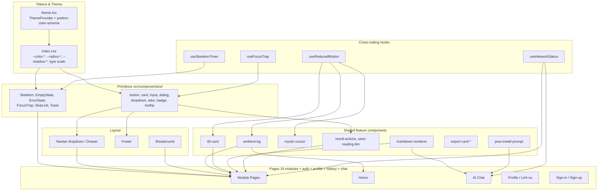
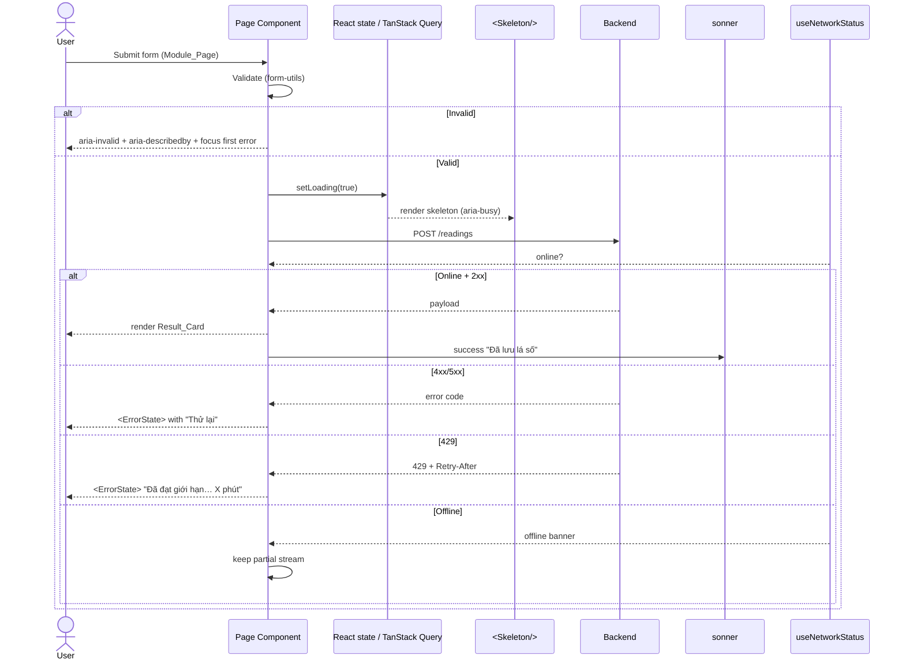
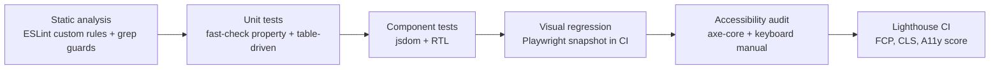

# Design Document — UX/UI Upgrade

## Overview

Bản nâng cấp UX/UI của **Huyền Bí** là một đợt cải tổ frontend toàn diện trên `artifacts/mysticism-web/`, không thay đổi backend hay logic huyền học. Trục thiết kế gồm bốn nhóm: (1) hợp nhất hệ thống thiết kế (tokens, typography, spacing, radius, shadow), (2) đạt WCAG 2.1 AA và responsive trên 4 breakpoint, (3) hoàn thiện loading/error/empty/network state, (4) gia cố bản sắc huyền bí và loại bỏ các "AI tropes" (gradient tím-hồng, padding khổng lồ, bo `2xl` đồng nhất, shadow nhiều lớp).

Phần lớn công việc là rendering UI và tổ chức markup. Một số khu vực có logic thuần (validation form, định dạng số điện thoại / biển số, parse ngày `dd/MM/yyyy`, tính `Retry-After`, thời gian tương đối, normalize Color_Token cho SVG export) có thể kiểm thử bằng property-based testing để bắt edge case.

### Mục tiêu thiết kế

1. **Tính nhất quán**: mọi mô-đun chia sẻ một bộ token / primitive / motion language; giảm "drift" giữa 15 trang.
2. **Tiếp cận**: bàn phím, focus ring, trình đọc màn hình, skip link, contrast 4.5:1 (text) và 3:1 (UI).
3. **Phản hồi cảm nhận**: skeleton thay spinner toàn trang, optimistic update, lazy-load cho component nặng, không CLS > 0.1.
4. **Bản sắc**: vàng `#c9a227` chỉ làm điểm nhấn; nền tím đêm `#0d0818`; ambient orbs giảm opacity ở light mode; typography Playfair / Plus Jakarta / Space Mono.
5. **Tài liệu hoá**: mọi token/quy ước được mô tả trong `src/components/ui/README.md` và `docs/ux-guidelines.md`; trang `/dev/design-tokens` cho QA trực quan trong build dev.

### Các quyết định thiết kế chính (rationale)

- **Theme provider hiện hữu (`@/contexts/theme.tsx`) tiếp tục được dùng**, nhưng bổ sung token light mode đầy đủ trong `src/index.css` và logic theo `prefers-color-scheme` cho lượt truy cập đầu tiên. Lý do: code đã có khung; làm lại theme manager sẽ kéo theo mọi page test.
- **Border radius dùng 4 mức tách rời** (`--radius-sm` 4px, `--radius-md` 6px, `--radius-lg` 12px, `--radius-xl` 20px), thay vì công thức `calc(--radius ± n)` hiện tại — vì công thức đó tạo `--radius-lg = 0` (do `--radius: 0rem`) khiến mọi card vuông như hiện trạng.
- **Animation orchestrator dùng Framer Motion với `LazyMotion`** (`domAnimation`), giảm bundle ~20KB. Reduced-motion áp `<MotionConfig reducedMotion="user">` để fade ≤ 150ms cho mọi `motion.*` con.
- **Toast lib giữ `sonner`** (đã ở deps) thay vì viết wrapper mới quanh `useToast`. Dùng `richColors` cho success/error nhất quán với Color_Token.
- **PWA prompt và Mystic Cursor đặt sau `<Toaster />` trong cây React**, bảo đảm `aria-live` của toast không bị che bởi cursor canvas.
- **Trang `/dev/design-tokens` được tree-shake bằng `import.meta.env.DEV` guard** kèm dynamic import; production build (Vite production mode) sẽ loại bỏ component và route.

### Phạm vi (Scope)

**In scope**:
- `artifacts/mysticism-web/src/index.css` — bổ sung token `light`, `--radius-*`, `--shadow-sm/md`, `font-display: swap`.
- `src/contexts/theme.tsx` — đọc `prefers-color-scheme`, persist trong `localStorage`, `<meta name="theme-color">` đồng bộ.
- `src/components/ui/*` — primitive Button, Card, Input, Dialog, Dropdown, Tabs, Badge, Tooltip, Skeleton, EmptyState, ErrorState, FocusTrap, SkipLink (mới).
- `src/components/layout/{navbar,footer}.tsx` — desktop dropdown, mobile drawer, sticky + backdrop blur, breadcrumb component.
- 15 trang mô-đun: chuẩn hoá Result_Card, biểu đồ SVG `viewBox` + `currentColor`, action group, table với `<thead scope>`.
- `src/pages/{home,profile,lich-su,ai-chat,sign-in,sign-up}.tsx`.
- `src/components/{ambient-bg,tilt-card,mystic-cursor,save-reading-btn,result-actions,export-card-*,pwa-install-prompt}.tsx`.
- `src/components/ui/markdown-renderer.tsx`.
- `src/lib/form-utils.ts` — validators và formatters (số điện thoại, biển số, parse `dd/MM/yyyy`).
- Tài liệu mới: `src/components/ui/README.md`, `docs/ux-guidelines.md`, route `/dev/design-tokens`.

**Out of scope**:
- API routes, schema DB, logic huyền học (numerology, batu, iching, …).
- Bảo mật: đảm bảo XSS/CSRF/rate-limiting đã có vẫn nguyên vẹn — chỉ bổ sung `aria-*`, không đổi behavior network.
- Service Worker (chỉ thêm offline banner ở client; không làm offline-first toàn module).
- Internationalization beyond Vietnamese (hardcoded `lang="vi"`).

---

## Architecture

### Sơ đồ phân lớp



### Data flow ở runtime



### Lazy-loading boundary

Đã có `React.lazy` cho 15 trang trong `App.tsx`. Bổ sung lazy boundary cho:

- `export-card-*` + `html2canvas` + `jsPDF` (chỉ load khi user mở dropdown "Xuất").
- `recharts` cho biểu đồ phức tạp (radar, donut) — wrap trong `<Suspense fallback={<Skeleton className="h-64 w-full" />}>`.
- `markdown-renderer` đã được dùng trên AI chat; bổ sung `IntersectionObserver` để chỉ mount khi bubble vào viewport.

### Theme switching pipeline

```mermaid
flowchart LR
  P[User click toggle] --> S[ThemeProvider.setTheme]
  M[prefers-color-scheme] --> S
  S --> LS[localStorage 'theme']
  S --> H[<html class="light|dark">]
  H --> CSS[CSS vars resolve]
  CSS --> SVG[SVG fill='currentColor']
  CSS --> META[<meta name=theme-color> updated]
```

Token light mode được định nghĩa đầy đủ trong `.light { … }` (cùng cấu trúc với `.dark`), với các giá trị HSL được kiểm contrast 4.5:1 trước khi commit (sử dụng spreadsheet kèm trong `docs/ux-guidelines.md`).

### Animation language

| Kiểu chuyển | Thời lượng | Easing | Triggered by |
|---|---|---|---|
| Hover button/card | 120–180ms | `ease-out` `cubic-bezier(0.22, 0.61, 0.36, 1)` | mouseenter |
| Dropdown / Dialog enter | 200–280ms | ease-out | open |
| Dropdown / Dialog exit | 180–220ms | ease-in `cubic-bezier(0.4, 0, 1, 1)` | close |
| Tab switch | 200ms | ease-out | click/key |
| Scroll reveal section | 500–700ms | ease-out | IntersectionObserver |
| Toast enter/exit | 240ms | ease-out / ease-in | sonner default |
| Tilt-card | continuous | spring `{ stiffness: 120, damping: 18 }` | mouse move |

`useReducedMotion()` trả `true` ⇒ toàn bộ chuyển cảnh giảm về fade ≤ 150ms; `tilt-card` tắt; `ambient-bg` giảm orbs xuống tĩnh; `shimmer-text` loại class lặp.

---

## Components and Interfaces

### 1. Design tokens (`src/index.css`)

Bổ sung block `.light` đầy đủ và 4 mức radius rõ ràng:

```css
:root {
  --radius-sm: 0.25rem;  /* 4px — input, badge */
  --radius-md: 0.375rem; /* 6px — button */
  --radius-lg: 0.75rem;  /* 12px — card */
  --radius-xl: 1.25rem;  /* 20px — hero, dialog lớn */

  --shadow-sm: 0 1px 2px hsl(var(--background) / 0.4);
  --shadow-md: 0 4px 12px hsl(var(--background) / 0.5);

  /* Type scale */
  --font-size-display: 3rem;
  --font-size-h1: 2.25rem;
  --font-size-h2: 1.75rem;
  --font-size-h3: 1.375rem;
  --font-size-body: 1rem;
  --font-size-small: 0.875rem;
}
.light {
  --background: 40 30% 98%;
  --foreground: 260 40% 10%;
  --primary: 43 74% 42%;          /* darken 7% so text on light card đạt 4.5:1 */
  --primary-foreground: 0 0% 100%;
  --card: 40 30% 100%;
  --muted: 40 20% 92%;
  --muted-foreground: 260 20% 30%;
  --border: 260 10% 80%;
  --ring: 43 74% 42%;
  /* … */
}
```

`@font-face` preload bằng `<link rel="preload">` trong `index.html`; `font-display: swap`.

### 2. Primitive components mới hoặc nâng cấp

| Component | Trạng thái | Mô tả |
|---|---|---|
| `Skeleton` | có (Radix) | Bổ sung biến thể `card`, `chart`, `list-row`. |
| `EmptyState` | mới | Props: `icon`, `title`, `description`, `cta`. `role="status"`. |
| `ErrorState` | mới | Props: `title`, `description`, `onRetry`, `homeHref`. `role="alert"`. |
| `FocusTrap` | mới (wrapper Radix Focus Scope) | Dùng trong drawer mobile menu. |
| `SkipLink` | mới | Hiện khi `:focus`, dẫn tới `#main`. |
| `Breadcrumb` | có (shadcn) | Bổ sung `aria-current="page"` cho mục cuối. |
| `Button` | có | Thêm prop `loadingText` (Vietnamese), spinner inline, `aria-busy`. |
| `Input` | có | Hỗ trợ `error`, `helperText`, `aria-invalid`, `aria-describedby`. |
| `DateInput` | mới | Wrap `react-day-picker` + text input `dd/MM/yyyy`. |
| `Toast` | có (sonner) | Wrap với defaults `richColors`, `duration: 4000`, `position: "top-center"` mobile / `"bottom-right"` desktop. |

### 3. Layout

#### Navbar (`src/components/layout/navbar.tsx`)

- Desktop (≥768px): logo + 5 dropdown (Số Học, Mệnh Lý, Tiên Tri, Tra Cứu, Trợ Lý AI) dùng Radix `NavigationMenu`.
- Mobile (<768px): hamburger trigger mở `<Drawer>` (vaul) trượt từ trái, có FocusTrap, đóng khi click một liên kết.
- Sticky: `position: sticky; top: 0; backdrop-filter: blur(12px); background: hsl(var(--background) / 0.7);`.
- Active page: `aria-current="page"` + `text-primary` trên link match.
- Avatar dropdown (Clerk `<UserButton/>` nếu đăng nhập, hoặc nút "Đăng nhập / Đăng ký").

#### Footer (`src/components/layout/footer.tsx`)

- Grid 4 cột (≥1024px), 2 cột (tablet), 1 cột (mobile).
- Cột: Số Học / Mệnh Lý / Tiên Tri / Tra Cứu (group links) + cột Tài khoản (Hồ sơ, Lịch sử, Đăng ký) + chính sách.
- Hiển thị version từ `package.json` qua Vite define.

#### Breadcrumb component

Đặt trong `src/components/layout/breadcrumb.tsx`. Render:
```
Trang chủ → [Nhóm] → [Mô-đun]
```
Separator `<span aria-hidden="true">→</span>`. Dùng map `route → group → label`.

### 4. Result_Card và biểu đồ

- Result_Card có thứ tự: `<header>` (chủ thể) → key numbers → SVG chart → table → AI section → action group.
- SVG chart sử dụng `viewBox="0 0 100 100" preserveAspectRatio="xMidYMid meet"`, `fill="currentColor"`, `width="100%"`, `role="img"`, `aria-label`.
- Tooltip biểu đồ: dùng Radix Tooltip + `tabIndex={0}` cho từng segment để keyboard truy cập.
- Bảng dữ liệu: wrap bằng `<div className="overflow-x-auto">` chỉ trong breakpoint mobile (CSS only, dùng container query nếu khả dụng, fallback `md:overflow-visible`).
- Action group: 3 nút chính (Lưu, Chia sẻ, Xuất); trên mobile, "Xuất" trở thành dropdown chứa PNG/PDF/TXT.

### 5. Markdown renderer

Mở rộng `markdown-renderer.tsx`:
- Định nghĩa class cho `h1..h4`, `p`, `ul/ol`, `blockquote`, `code`, `pre`, `table`, `a`.
- `<a>` có `target="_blank" rel="noopener noreferrer"` cho link ngoài (phát hiện bằng `URL.host !== location.host`).
- Render incremental: chia đoạn theo block-level (`\n\n`), memo block đã render bằng key index.

### 6. Forms & validation

- Migrate sang `react-hook-form` + `zod` (đã có deps).
- `src/lib/form-utils.ts` chứa:
  - `parseVietnameseDate(input: string): Date | null`
  - `formatPhoneVN(raw: string): string` (chèn dấu chấm theo nhóm 3 chữ số)
  - `formatLicensePlate(raw: string): string` (`51A 12345` → `51A-123.45`)
  - `validateBirthDate(date: Date): { ok: true } | { ok: false; reason: string }` (1900–2100)
  - `parseRetryAfter(header: string | null, now = Date.now()): number /* seconds */`
- Hiển thị lỗi: `<p id="${name}-error" role="alert">` liên kết qua `aria-describedby`.
- Submit-with-errors: gọi `errorRefs[firstErrorName]?.focus()` và `scrollIntoView({ block: "center", behavior: "smooth" })`.

### 7. Network status & offline

Hook mới `useNetworkStatus()`:
- Subscribe `online`/`offline` events.
- Hiển thị banner sticky ở đỉnh khi offline (`role="status"`, slot trên header).
- Khi reconnect: ẩn banner và emit toast "Đã kết nối lại" (sonner).
- Disable nút phụ thuộc backend bằng prop `disabled` + Tooltip "Cần kết nối mạng".

### 8. PWA install prompt

- Dùng `beforeinstallprompt` event; iOS Safari fallback: detect `navigator.standalone === false && /iPad|iPhone|iPod/.test(navigator.userAgent)`.
- Lưu cờ `localStorage["pwa-install-dismissed-at"] = Date.now()`; ẩn 14 ngày.
- Banner mảnh ở đáy (mobile), card góc dưới phải (desktop). Không phải modal.

### 9. Mystic Cursor

- Toggle trong Avatar dropdown "Preferences"; persist `localStorage["mystic-cursor-enabled"]`.
- Detect `(hover: hover)` qua `matchMedia`.
- `aria-hidden="true"` trên canvas/svg cursor; trapezoid hit-test bypass `pointer-events: none`.
- Reduced motion: bỏ trail; chuyển cursor về system khi user prefers reduced motion + chưa override.

### 10. AI Chat (`/ai-chat`)

- Bubble: `<li role="listitem">` trong `<ul role="log" aria-live="polite">`.
- Auto-scroll-to-bottom: chỉ khi user đã ở đáy (`scrollHeight - clientHeight - scrollTop < 100`); ngược lại hiện nút "Tin nhắn mới ↓".
- Stop streaming: huỷ `AbortController`; giữ text đã stream.
- Suggestion chips: 14 chip cố định trên ô input; click ⇒ điền `<textarea>` và `focus`.
- Enter / Shift+Enter: handler `onKeyDown` kiểm `e.shiftKey`.
- Persist: `localStorage["ai-chat-messages"]` cho phiên unauth; hợp nhất khi đăng nhập qua API.

### 11. Profile & Lịch sử

- Profile grid: 1/2/3/4 cột theo breakpoint, `<Card>` cho mỗi lá số.
- Filter & search: state local `filter: { module, query }`, debounce 300ms.
- So sánh: chọn 2 checkbox ⇒ enable `<Button>` "So sánh" ⇒ mở `<Dialog>` 2 cột (md+) hoặc xếp chồng (mobile).
- Xoá: dialog xác nhận, yêu cầu nhấn "Xoá" lần thứ hai. Optimistic remove + rollback toast nếu API lỗi.
- Lịch sử: `<table>` với `<thead>`, sortable cột; lọc theo mô-đun; xoá từng dòng / xoá toàn bộ.
- Widget thống kê: tổng số lá số, mô-đun dùng nhiều nhất, lần tra cứu gần nhất.

### 12. Trang `/dev/design-tokens`

Đặt trong `src/pages/dev/design-tokens.tsx`. Route đăng ký trong `App.tsx` với guard:

```tsx
{import.meta.env.DEV && <Route path="/dev/design-tokens" component={DesignTokensPage} />}
```

Hiển thị bảng: color tokens (8 ô mỗi token, light + dark), type scale, spacing (1–16), border radius (4 mức), button variants (primary, secondary, ghost, destructive), badge variants, shadows.

---

## Data Models

Bản nâng cấp UX/UI không thay đổi data model phía API. Các kiểu dữ liệu mới chỉ tồn tại ở client.

### Theme

```ts
type Theme = "light" | "dark";

interface ThemeContextValue {
  theme: Theme;
  setTheme: (next: Theme) => void;
  /** true khi user chưa override; theme bám prefers-color-scheme. */
  isSystem: boolean;
}
```

Persist: `localStorage["theme"]` chứa `"light"` | `"dark"` | `null` (khi `null`, bám `prefers-color-scheme`).

### Network state

```ts
type NetworkStatus = "online" | "offline";

interface UseNetworkStatusResult {
  status: NetworkStatus;
  /** Timestamp khi chuyển sang offline gần nhất, null khi online. */
  offlineSince: number | null;
}
```

### Form error model

```ts
interface FieldError {
  name: string;
  message: string;          // tiếng Việt
  /** id của <p> chứa thông báo, dùng cho aria-describedby */
  describedById: string;
}

interface FormErrorState {
  errors: FieldError[];
  firstErrorRef: HTMLElement | null;
}
```

### Toast model (wrapper sonner)

```ts
type ToastVariant = "success" | "error" | "info" | "warning";

interface ShowToastOptions {
  variant: ToastVariant;
  title: string;            // tiếng Việt, sentence case
  description?: string;
  durationMs?: number;      // default 4000
  retry?: () => void;       // chỉ dùng cho variant "error"
}
```

### PWA install prompt state

```ts
interface PwaPromptState {
  /** Số lần tra cứu thành công (>= 1 mới hiện). */
  successfulReadingsCount: number;
  /** Timestamp lần dismiss gần nhất, null nếu chưa từng. */
  dismissedAt: number | null;
  /** true khi đang trong cooldown 14 ngày. */
  inCooldown: boolean;
}
```

Persist: `localStorage["pwa-prompt-state"]` (JSON).

### Mystic cursor preference

```ts
interface MysticCursorPref {
  enabled: boolean;
  /** true khi prefers-reduced-motion hoặc thiết bị cảm ứng. */
  disabledBySystem: boolean;
}
```

### Saved reading filter (Profile)

```ts
interface SavedReadingFilter {
  module: ModuleId | "all";
  query: string;             // free text, lower-cased trước khi match
}

type ModuleId =
  | "than-so-hoc" | "bat-tu" | "xem-que" | "cat-hung" | "lich-van-nien"
  | "tu-vi" | "phong-thuy" | "xem-ten" | "lich-ca-nhan" | "tu-dien"
  | "hop-tuoi" | "xem-ngay-tot" | "sao-han" | "ai-chat";
```

### Time formatting

```ts
/** "vừa xong" | "n phút trước" | "n giờ trước" | "n ngày trước" | tooltip ISO */
interface RelativeTime {
  label: string;
  iso: string;
}
```

### Retry-After

```ts
/** Trả số giây phải chờ; 0 nếu header không hợp lệ. */
type ParseRetryAfter = (header: string | null, now?: number) => number;
```

---


## Correctness Properties

*A property is a characteristic or behavior that should hold true across all valid executions of a system — essentially, a formal statement about what the system should do. Properties serve as the bridge between human-readable specifications and machine-verifiable correctness guarantees.*

Phần lớn các yêu cầu của bản nâng cấp UX/UI là rendering UI và quy ước style — kiểm thử bằng snapshot hoặc lint là phù hợp. Tuy nhiên 20 thuộc tính dưới đây mô tả các bất biến thực sự mang tính phổ quát ("for all"), được rút ra từ phần Acceptance Criteria Testing Prework. Các thuộc tính này hiện thực được bằng property-based testing (sử dụng `fast-check`, đã có trong `devDependencies`).

### Property 1: Bất biến độ tương phản giữa Color_Token và theme

*For any* cặp `(foreground, background)` được khai báo trong `design-tokens` và *for any* `theme ∈ {light, dark}`, tỉ lệ tương phản WCAG giữa hai token phải ≥ 4.5 cho text thường và ≥ 3 cho text lớn / phần tử UI; *for any* `theme`, tỉ lệ tương phản giữa `--ring` và `--background` phải ≥ 3.

**Validates: Requirements 2.1, 3.2, 3.8**

### Property 2: Round-trip lựa chọn theme

*For any* `theme ∈ {light, dark}` mà người dùng chọn, sau khi gọi `setTheme(theme)`, giá trị trong `localStorage["theme"]` bằng `theme` và class trên `<html>` bằng `theme`; tải lại với cùng giá trị `localStorage` phải khôi phục đúng class.

**Validates: Requirements 2.3**

### Property 3: Theme mặc định bám `prefers-color-scheme`

*For any* `prefers-color-scheme ∈ {light, dark}`, khi `localStorage["theme"]` chưa tồn tại, theme được áp dụng bằng đúng giá trị system preference đó.

**Validates: Requirements 2.4**

### Property 4: Ambient_Background giảm opacity ở light mode

*For any* orb thuộc `Ambient_Background`, opacity ở light mode ≤ 0.6 lần opacity ở dark mode (giảm tối thiểu 40%); và *for any* route không thuộc `{home} ∪ Module_Page`, `Ambient_Background` không được mount; *for any* (route mounted, theme), opacity tối đa của orb không vượt 0.35 (dark) hoặc 0.15 (light).

**Validates: Requirements 2.6, 10.8**

### Property 5: Tab traversal phủ toàn bộ phần tử tương tác theo thứ tự DOM

*For any* trang trong tập 15 Module_Page + `home` + `profile` + `lich-su` + `ai-chat` + `sign-in` + `sign-up`, gọi `Tab` liên tiếp `N` lần với `N` là số phần tử focusable trên trang phải duyệt qua mỗi phần tử focusable đúng một lần và theo thứ tự xuất hiện trong DOM tree.

**Validates: Requirements 3.1**

### Property 6: Focus trap và khôi phục focus

*For any* dialog hoặc dropdown menu với `K` phần tử focusable bên trong (`K ≥ 1`), khi mở: (a) `document.activeElement` là phần tử focusable đầu tiên bên trong; (b) gọi `Tab` đúng `K + 1` lần đưa focus quay lại phần tử đầu tiên (focus trap); (c) gọi `Escape` đóng panel và `document.activeElement === trigger`.

**Validates: Requirements 3.6, 3.7**

### Property 7: ARIA hygiene cho form và trạng thái

*For any* `Form_Input` được render với prop `error="..."` (lỗi không rỗng), phần tử nhận `aria-invalid="true"` và `aria-describedby` trỏ tới `id` của một phần tử thực sự tồn tại trong DOM chứa thông báo lỗi; *for any* container ở `Loading_State` có `aria-busy="true"`; *for any* `EmptyState` hoặc `ErrorState` có `role="status"` hoặc `role="alert"` tương ứng; *for any* `Form_Input`, có một `<label>` được liên kết qua `htmlFor` hoặc bao bọc.

**Validates: Requirements 3.4, 3.5, 5.8, 6.3**

### Property 8: Không tràn ngang ở mọi breakpoint

*For any* `(page, width)` với `page` thuộc tập 15 Module_Page + `home` + `profile` + `lich-su` + `ai-chat` và `width ∈ {320, 768, 1024, 1440}`, sau khi render trong jsdom với chiều rộng đó, `document.documentElement.scrollWidth ≤ width`; ngoại lệ duy nhất là phần tử có class `overflow-x-auto` được đánh dấu là bảng dữ liệu.

**Validates: Requirements 4.1, 4.7**

### Property 9: Drawer mobile đóng sau khi click link

*For any* liên kết `link` trong drawer mobile (gồm 5 nhóm × các module + các mục tài khoản), khi mở drawer rồi click `link`, sau một tick render drawer ở trạng thái đóng (`open === false`).

**Validates: Requirements 4.2**

### Property 10: Form input chiều cao chạm tối thiểu trên mobile

*For any* `inputType ∈ {text, date, select, radio, textarea, number}` được render ở chiều rộng viewport 320px, chiều cao computed của vùng tương tác ≥ 44px.

**Validates: Requirements 4.3**

### Property 11: Validation form là hàm thuần đúng đắn và live-revalidation

*For any* giá trị nhập vi phạm một trong các ràng buộc `{day > 31 hoặc day < 1, month > 12 hoặc month < 1, year < 1900 hoặc year > 2100, hour < 0 hoặc hour > 23, phoneDigits.length < 10}`, hàm `validate(value)` trả `{ ok: false, reason: <thông báo tiếng Việt nêu rõ ràng buộc bị vi phạm> }`; *for any* giá trị thoả tất cả ràng buộc, trả `{ ok: true }`. *For any* chuỗi sự kiện input chuyển từ giá trị invalid sang valid, thông báo lỗi biến mất ngay sau `onChange` mà không cần `onBlur`.

**Validates: Requirements 6.1, 6.2, 6.4**

### Property 12: Round-trip parser ngày `dd/MM/yyyy`

*For any* `Date` `d` trong khoảng `[1900-01-01, 2100-12-31]`, `parseVietnameseDate(formatVietnameseDate(d)) ≡ d`; và *for any* chuỗi `s` hợp lệ định dạng `dd/MM/yyyy`, `formatVietnameseDate(parseVietnameseDate(s)) ≡ s`.

**Validates: Requirements 6.6**

### Property 13: Formatter số điện thoại / biển số là idempotent và bảo toàn raw

*For any* chuỗi đầu vào `s` (chữ số có thể xen ký tự), `rawDigits(formatPhoneVN(s)) ≡ rawDigits(s)` và `formatPhoneVN(formatPhoneVN(s)) ≡ formatPhoneVN(s)` (idempotence). Tương tự với `formatLicensePlate`. Định dạng phải được áp dụng kể cả khi `error === true` (component vẫn render giá trị đã format).

**Validates: Requirements 6.8**

### Property 14: Submit form lỗi focus phần tử lỗi đầu tiên

*For any* form có `K ≥ 1` lỗi tại các vị trí ngẫu nhiên, sau khi submit, `document.activeElement` là phần tử lỗi xuất hiện đầu tiên trong thứ tự DOM và `scrollIntoView` được gọi cho phần tử đó.

**Validates: Requirements 6.5**

### Property 15: ErrorState chuẩn cho mọi mã lỗi 4xx/5xx

*For any* `status ∈ [400, 599]`, khi render `ErrorState` với mã đó, kết quả chứa: tiêu đề tiếng Việt, mô tả nguyên nhân, một button có nhãn "Thử lại" gắn `onClick` gọi cùng request, và một liên kết `href="/"` về trang chủ. *For any* `status === 429` với header `Retry-After`, thông báo chứa số phút bằng `ceil(parseRetryAfter(header) / 60)`.

**Validates: Requirements 5.4, 5.5**

### Property 16: Parser `Retry-After`

*For any* giá trị header `Retry-After` hợp lệ — số nguyên giây trong `[0, 86400]` hoặc HTTP-date đại diện thời điểm `now + Δ`, hàm `parseRetryAfter(header, now)` trả về một số `s ≥ 0` và `|s − Δ| ≤ 1` (sai số ≤ 1 giây). *For any* header không hợp lệ, hàm trả `0`.

**Validates: Requirements 5.5**

### Property 17: Cấu hình Motion bám duration / easing / reduced-motion

*For any* variant trong `animationRegistry`, nếu là transition tương tác (button, dropdown, dialog) thì `duration ∈ [120, 400]ms`; nếu là reveal/transition trang thì `duration ∈ [400, 800]ms`; easing của enter là `cubic-bezier(0.22, 0.61, 0.36, 1)` và của exit là `cubic-bezier(0.4, 0, 1, 1)`; không variant nào dùng `linear`. *For any* variant khi `prefers-reduced-motion: reduce`, transition resolve thành fade với `duration ≤ 150ms` và chỉ thay đổi thuộc tính `opacity`.

**Validates: Requirements 9.2, 9.3, 9.4**

### Property 18: Tilt-card giới hạn độ nghiêng

*For any* vị trí chuột trong vùng card, độ nghiêng `rotateX` và `rotateY` (độ) tính được thoả `|angle| ≤ 8` ở chế độ thường và không bao giờ vượt `±15` (giới hạn cứng).

**Validates: Requirements 9.6**

### Property 19: Persist hội thoại AI round-trip

*For any* mảng tin nhắn `messages` (gồm role `user`/`assistant`, nội dung, timestamp), `loadMessages(saveMessages(messages)) ≡ messages` (deep-equal); thuộc tính giữ nguyên cho cả backend `localStorage` (unauth) và API store (auth) khi mock.

**Validates: Requirements 13.8**

### Property 20: Trạng thái máy hữu hạn của PWA install prompt

*For any* dãy sự kiện `events` với mỗi sự kiện thuộc `{successful_reading, dismiss(t), install, time_advance(Δt)}`, hàm tính `shouldShowPrompt(state)` thoả: (a) `false` khi `successfulReadingsCount === 0`; (b) `false` khi `dismissedAt !== null` và `now − dismissedAt < 14 * 24 * 3600 * 1000`; (c) `true` khi đã có ≥ 1 reading thành công và (chưa từng dismiss hoặc đã hết cooldown 14 ngày); (d) `false` vĩnh viễn sau khi user `install` (không còn hỏi lại).

**Validates: Requirements 16.1, 16.2**

---

Các tiêu chí khác (chiếm khoảng 60% tổng số acceptance criteria) được kiểm bằng:
- **Lint / static-scan (SMOKE)**: 1.1, 1.2, 1.5, 1.6, 1.7, 2.5, 3.11, 9.1, 10.2, 10.3, 10.6, 10.7, 11.4, 11.5, 19.x, 20.1, 20.2, 20.3, 20.4.
- **Example / snapshot tests (EXAMPLE)**: 1.3, 1.4, 2.2, 2.7, 3.9, 3.10, 3.12, 4.5, 4.8, 5.1, 5.3, 6.7, 6.9, 7.x (trừ 7.3, 7.4), 8.7, 8.8, 9.5, 10.1, 10.4, 10.5, 11.1, 11.7, 12.1, 12.4, 12.5, 12.6, 13.3, 14.5, 15.x, 16.3, 16.4, 17.4.

Các property-classified criteria không xuất hiện trong danh sách 20 thuộc tính trên (ví dụ 7.3 active link, 7.4 breadcrumb, 8.x Result_Card structure, 11.x optimistic update, 12.2/12.3 home grid, 13.x AI chat behaviours, 14.x profile, 17.x cursor, 18.x offline) được kiểm thử bằng `it.each(...)` qua tập fixture cố định (mỗi page / mỗi module / mỗi state) — đây là test **table-driven** chứ không phải property-based: phổ quát bị giới hạn bởi tập hữu hạn route/module/breakpoint nên giá trị của 100 vòng lặp ngẫu nhiên thấp hơn so với danh sách fixture được liệt kê tường minh.

---

## Error Handling

### Phân loại lỗi và phản hồi UI

| Tình huống | UX phản hồi | Thành phần phụ trách |
|---|---|---|
| Network 4xx (validation, auth) | `ErrorState` inline tại Result_Card — tiêu đề, mô tả, nút "Thử lại", liên kết về `/`. | `<ErrorState>` |
| Network 5xx (server) | `ErrorState` inline, log lỗi vào `console.error` (không gửi telemetry trong scope này). | `<ErrorState>` |
| Network 429 (rate-limit AI) | `ErrorState` riêng "Đã đạt giới hạn lượt gọi AI. Vui lòng thử lại sau X phút." với `X = ceil(parseRetryAfter(header)/60)`. | `<ErrorState variant="rate-limit">` |
| Mất kết nối khi đang stream AI | Banner cảnh báo "Mất kết nối — đang thử lại…", giữ text đã stream, retry tối đa 2 lần với backoff 1s, 2s. | `useAiSseChat` + `useNetworkStatus` |
| Mạng offline (toàn cục) | Banner sticky "Bạn đang offline" trên đỉnh trang; client-only modules vẫn dùng được; backend-required actions disabled với tooltip. | `<OfflineBanner>` |
| Reconnect | Banner ẩn; toast "Đã kết nối lại" trong ≤ 4s. | sonner toast |
| Fetch timeout (≥ 30s) | Cancel via `AbortController`; **chờ abort hoàn tất** trước khi render `ErrorState` "Hết thời gian chờ — vui lòng thử lại". | `fetchWithTimeout` helper |
| Validation form (client) | Lỗi inline dưới input, `aria-invalid="true"`, `aria-describedby`, focus phần tử lỗi đầu tiên khi submit. | `<Input error/>` + `react-hook-form` |
| Clipboard write fail | Toast warning "Không thể sao chép. Hãy chọn và sao chép thủ công." | sonner |
| Save reading khi unauth | Dialog "Bạn cần đăng nhập để lưu lá số." với 2 nút "Đăng nhập" / "Để sau". | `<AuthRequiredDialog>` |
| Delete reading | Dialog xác nhận; yêu cầu nhấn "Xoá" lần thứ hai trong dialog để hoàn tất; optimistic remove + rollback toast nếu API fail. | `<DeleteConfirmDialog>` |
| Lazy-load chunk fail (export-card, recharts) | `ErrorState` "Không tải được tính năng. Vui lòng tải lại trang." kèm nút reload. | `<ErrorBoundary>` quanh `Suspense` |
| Render exception (any uncaught) | Top-level `<ErrorBoundary>` hiển thị `ErrorState` toàn trang với nút "Tải lại trang"; trong dev mode hiển thị stack. | `<RootErrorBoundary>` |
| Clerk publishable key thiếu | Banner trên `/sign-in` và `/sign-up`: "Tài khoản tạm thời chưa khả dụng. Bạn vẫn có thể dùng 15 mô-đun không cần đăng nhập." | `<ClerkConfigBanner>` |

### Thông điệp tiếng Việt chuẩn

Định nghĩa trong `src/lib/error-messages.ts`:

```ts
export const ERROR_MESSAGES = {
  network_offline: "Bạn đang offline. Một số tính năng tạm thời không khả dụng.",
  network_lost_during_stream: "Mất kết nối — đang thử lại…",
  network_reconnected: "Đã kết nối lại",
  rate_limit: (mins: number) =>
    `Đã đạt giới hạn lượt gọi AI. Vui lòng thử lại sau ${mins} phút.`,
  server_error: "Đã có lỗi từ máy chủ. Vui lòng thử lại sau ít phút.",
  client_error: "Yêu cầu chưa hợp lệ. Vui lòng kiểm tra lại thông tin.",
  timeout: "Hết thời gian chờ. Vui lòng thử lại.",
  unauth_save: "Bạn cần đăng nhập để lưu lá số.",
  delete_irreversible: "Thao tác xoá không thể hoàn tác. Bạn chắc chắn?",
  clipboard_fail: "Không thể sao chép. Hãy chọn và sao chép thủ công.",
  validation: {
    required: "Vui lòng nhập trường này",
    invalidDate: "Ngày không hợp lệ (định dạng dd/MM/yyyy)",
    yearRange: "Năm phải trong khoảng 1900–2100",
    hourRange: "Giờ phải trong khoảng 0–23",
    phoneLength: "Số điện thoại phải có ít nhất 10 chữ số",
  },
} as const;
```

### Retry / backoff

- AI streaming retry: tối đa 2 lần, backoff `1s`, `2s`. Sau lần 3 hiển thị `ErrorState` cho phép user retry thủ công.
- Save reading retry: không tự retry; rollback optimistic + toast lỗi.
- Fetch khác: không tự retry trừ khi user click "Thử lại".

### Logging

Trong scope UX/UI upgrade chỉ ghi `console.error` (chuẩn hoá format `[ux-ui-upgrade] ${context}: ${err.message}`). Không thêm telemetry / analytics — phạm vi nằm ngoài tài liệu này.

---

## Testing Strategy

### Phân tầng



### 1. Static analysis (SMOKE)

Đặt trong `scripts/lint-design-system.ts`:

- `no-hex-in-tsx`: regex scan `#([0-9a-fA-F]{3,8})\b` trong `.tsx` (allowlist: `index.css`, `export-card-*.tsx`).
- `no-arbitrary-spacing`: regex `(?:p|m|gap|px|py|mx|my)-\[\d+(?:\.\d+)?(?:px|rem)\]`.
- `no-banned-shadow`: regex `shadow-(2xl|xl)`.
- `no-purple-pink-indigo-gradient`: regex pattern bắt gradient AI mặc định.
- `no-emoji-in-jsx`: regex bắt các điểm code emoji trong text JSX (cho phép `<span aria-label>` whitelist).
- `lang-attr`: assert `<html lang="vi">` trong `index.html`.
- Build assertion: production build (Vite production mode) không chứa từ `design-tokens` trong `dist/`.
- TSDoc presence: walk `src/components/ui/*.tsx`, mỗi `export` cần có JSDoc block.

### 2. Property-based tests (PROPERTY)

Sử dụng `fast-check` (đã trong devDependencies). Mỗi property tương ứng với một thuộc tính trong section "Correctness Properties". Cấu hình:

- Tối thiểu **100 iterations** cho mỗi property test (default `numRuns: 100`).
- Tag mỗi test bằng comment: `// Feature: ux-ui-upgrade, Property {n}: {title}`.
- File test sống cạnh module: ví dụ `src/lib/form-utils.property.test.ts`, `src/components/ui/contrast.property.test.ts`.

Ví dụ structure (Property 1 — Contrast):

```ts
// Feature: ux-ui-upgrade, Property 1: Contrast invariant for token pairs
import fc from "fast-check";
import { TOKEN_PAIRS, computeContrast, parseHsl } from "@/lib/design-tokens";

describe("Property 1: contrast invariant", () => {
  const themes = ["light", "dark"] as const;
  it.each(themes)(
    "every (fg,bg) pair satisfies WCAG AA in %s mode",
    (theme) => {
      fc.assert(
        fc.property(fc.constantFrom(...TOKEN_PAIRS), ({ fg, bg, sizeBucket }) => {
          const ratio = computeContrast(parseHsl(fg, theme), parseHsl(bg, theme));
          const min = sizeBucket === "large-or-ui" ? 3 : 4.5;
          return ratio >= min;
        }),
        { numRuns: 100 },
      );
    },
  );
});
```

Property 12 — Date round-trip (ví dụ):

```ts
// Feature: ux-ui-upgrade, Property 12: dd/MM/yyyy parser round-trip
fc.assert(
  fc.property(
    fc.date({ min: new Date(1900, 0, 1), max: new Date(2100, 11, 31) }),
    (d) => {
      const s = formatVietnameseDate(d);
      const back = parseVietnameseDate(s);
      return back !== null && back.getTime() === d.getTime();
    },
  ),
  { numRuns: 200 },
);
```

Generators được chuẩn bị một lần trong `src/test/generators.ts`:

- `arbForm`: form fixture với mix valid/invalid fields.
- `arbConversation`: mảng tin nhắn với role và timestamp.
- `arbReadingList`: mảng saved reading với module ngẫu nhiên.
- `arbBreakpoint`: `fc.constantFrom(320, 768, 1024, 1440)`.
- `arbHttpStatus`: `fc.integer({ min: 400, max: 599 })`.
- `arbRetryAfterHeader`: union of numeric seconds and HTTP-date.
- `arbMousePosition`: vị trí chuột trong card bounds.

### 3. Component tests (EXAMPLE / EDGE_CASE)

Sử dụng `vitest` (cần thêm) hoặc tiếp tục `tsx` runner hiện tại với `happy-dom` cho jsdom-like environment. Các test này:

- Mount component qua `@testing-library/react`.
- Verify ARIA, focus, keyboard, render state.
- Snapshot computed style cho Type_Scale fixtures.

Phạm vi:
- Skeleton / EmptyState / ErrorState rendering.
- Form helper text, success-keeps-values, helper text.
- Navbar logo click, drawer mobile open/close, avatar dropdown when authed.
- Sign-in/up Clerk wrapper props.
- iOS Safari fallback PWA prompt.
- Mystic cursor reduced-motion fallback.

### 4. Cross-page property tests

- **Property 5 (Tab traversal)** và **Property 8 (no overflow)** dùng fixture cross-page: chạy trên tất cả 19 routes (15 modules + home + profile + lich-su + ai-chat). Mỗi route render, chạy property assertion, đếm focusables / scrollWidth.

### 5. Visual regression

Playwright snapshot test cho:
- Trang chủ ở 4 breakpoint × 2 theme.
- Mỗi Module_Page Result_Card ở 2 theme.
- AI chat với 5 bubble và markdown phong phú.
- Export card output (PNG render từ `html2canvas`).

Threshold pixel diff: 0.1%. Snapshots commit vào repo dưới `__snapshots__/visual/`.

### 6. Accessibility audit

- `axe-core` chạy trên mỗi page fixture trong CI; fail trên `serious`/`critical` violations.
- Manual checklist tiếng Việt trong `docs/ux-guidelines.md` cho keyboard-only walkthrough trên 15 modules.

### 7. Lighthouse CI

- Profile mobile lab.
- Assert: FCP ≤ 1000ms, CLS ≤ 0.1, A11y score ≥ 95.
- Chạy trên PR; soft-fail trên bí khoá production-only metrics (LCP nếu phụ thuộc network thực).

### 8. Cấu hình test runner

- Bổ sung `vitest` vào devDependencies (đã có `tsx` cho test hiện tại).
- Thêm script `test:property` chạy `vitest run --include "**/*.property.test.ts"`.
- Thêm script `test:a11y` chạy `vitest run --include "**/*.a11y.test.ts"`.
- Thêm script `lint:design` chạy `tsx scripts/lint-design-system.ts`.
- Tích hợp tất cả vào `npm test` và pipeline CI.

### 9. Tổ chức file

```
src/
  lib/
    form-utils.ts
    form-utils.property.test.ts          # Property 11, 12, 13
    error-messages.ts
    network/
      retry-after.ts
      retry-after.property.test.ts       # Property 16
      use-network-status.ts
  components/
    ui/
      design-tokens.ts                   # token registry
      contrast.property.test.ts          # Property 1
      empty-state.tsx
      empty-state.test.tsx
      error-state.tsx
      error-state.property.test.ts       # Property 15
      focus-trap.tsx
      focus-trap.property.test.ts        # Property 6
      tilt-card.property.test.ts         # Property 18
      animation-registry.ts
      animation-registry.property.test.ts # Property 17
  contexts/
    theme.tsx
    theme.property.test.ts               # Property 2, 3
  pwa/
    pwa-prompt-state.ts
    pwa-prompt-state.property.test.ts    # Property 20
docs/
  ux-guidelines.md
scripts/
  lint-design-system.ts
__snapshots__/
  visual/
```

### 10. Trace matrix Property → Requirement

| Property | Requirements |
|---|---|
| 1 | 2.1, 3.2, 3.8 |
| 2 | 2.3 |
| 3 | 2.4 |
| 4 | 2.6, 10.8 |
| 5 | 3.1 |
| 6 | 3.6, 3.7 |
| 7 | 3.4, 3.5, 5.8, 6.3 |
| 8 | 4.1, 4.7 |
| 9 | 4.2 |
| 10 | 4.3 |
| 11 | 6.1, 6.2, 6.4 |
| 12 | 6.6 |
| 13 | 6.8 |
| 14 | 6.5 |
| 15 | 5.4, 5.5 |
| 16 | 5.5 |
| 17 | 9.2, 9.3, 9.4 |
| 18 | 9.6 |
| 19 | 13.8 |
| 20 | 16.1, 16.2 |

### 11. Out-of-scope test areas

- Backend security tests (đã có ở `artifacts/api-server/`).
- Logic huyền học (numerology, batu, …) — không đổi nên không re-test.
- Clerk widget internals — Clerk tự test.
- `html2canvas` / `jsPDF` library internals — chỉ snapshot output card.
